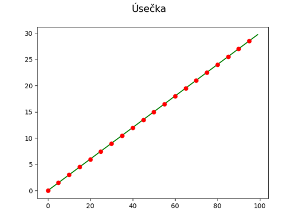

# Křivky v přírodě, architektuře, stavitelství i v počítačové grafice: matematický popis křivek

## Základní křivky

### Úsečka

- [zdrojový kód](lit_sources/basic/line.html)
- [zdrojový kód v literate stylu](https://github.com/tisnik/presentations/blob/master/curves/line.py)
