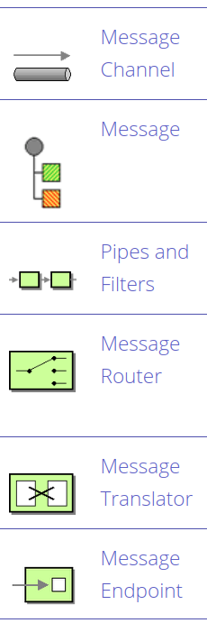
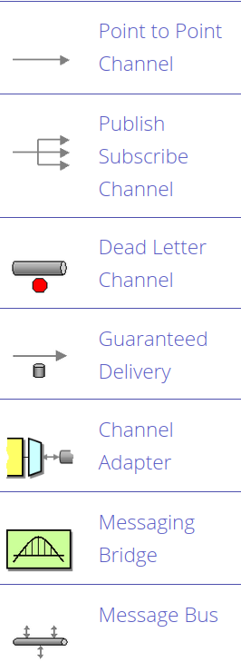
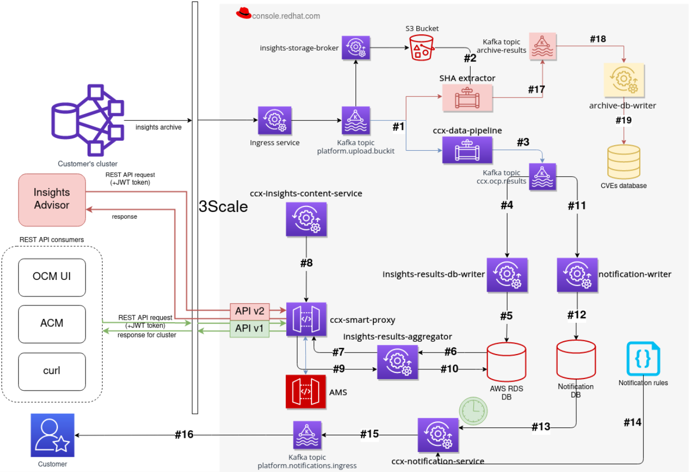

# Apache Camel


## Apache Camel 

* framework for message-oriented middleware
* rule-based routing
* based on Java
    - or can be based on declarative DSLs
* implementes EIP
    - Enterprise Integration Patterns


## Where? Why?

* message-oriented systems
* ETL-like processing
* connecting microservices
* partially solves problem with having many integration libraries and frameworks
    - usually complex class hierarchies that needs to be wired together
    - so the overall picture (the pattern) is lost
* connectivity to a great variety of transports and APIs
* focus toward Java world






## CCX pipelines

* (not all things we named "pipeline" is the real data pipeline!)




## Message Translator pattern

* more than 40 different data formats supported
    - JSON
    - YAML
    - Avro
    - Protobuf
    - XML
    - CSV


## Example #1

```java
public class MyRouteBuilder extends RouteBuilder {

    public void configure() {

        from("file:src/data?noop=true")
            .choice()
                .when(xpath("/person/city = 'London'"))
                    .to("file:target/messages/uk")
                .otherwise()
                    .to("file:target/messages/others");
    }

}
```


## Example #2

```java
 static RouteBuilder createRouteBuilder() {
        return new RouteBuilder() {
            public void configure() {
            from(DIRECT_KAFKA_START).routeId("DirectToKafka")
                    .to("kafka:{{producer.topic}}").log(HEADERS);

            // Topic can be set in header as well.

            from("direct:kafkaStartNoTopic").routeId("kafkaStartNoTopic")
                    .to("kafka:dummy")
                    .log(HEADERS);

            // Use custom partitioner based on the key.

            from(DIRECT_KAFKA_START_WITH_PARTITIONER).routeId("kafkaStartWithPartitioner")
                    .to("kafka:{{producer.topic}}?partitioner={{producer.partitioner}}")
                    .log(HEADERS);


            // Takes input from the command line.

            from("stream:in").id("input").setHeader(KafkaConstants.PARTITION_KEY, simple("0"))
                    .setHeader(KafkaConstants.KEY, simple("1")).to(DIRECT_KAFKA_START);

            }
        };
    }
```


## Pros

* encourages to use enterprise integration patterns
* Message Translator pattern is simple & powerful
* semi-standard in some areas
* stable tools, stable platform
* some tooling made in Red Hat
    - graphical plugin to Eclipse
* encourage thinging about our ETLs and how/if they are "special"


## Cons

* a framework
    - have to follow it's rules and structure
* based on Java
    - "classic" Java approach - one tool to rule them all
    - tend to be heavy (add all jokes about Java and memory...)
* not sure how flexible it should be for real world scenarios
    - DLQs
    - more advanced routing
    - more difficult filtering
* yet another technology
    - ten or more people will need to know it well
    - and be able to deploy it, monitor etc.
* performance?
    - we have quite strict requirements (DB writes etc.)


## Plans (within Processing team)

* N/A
* ?
