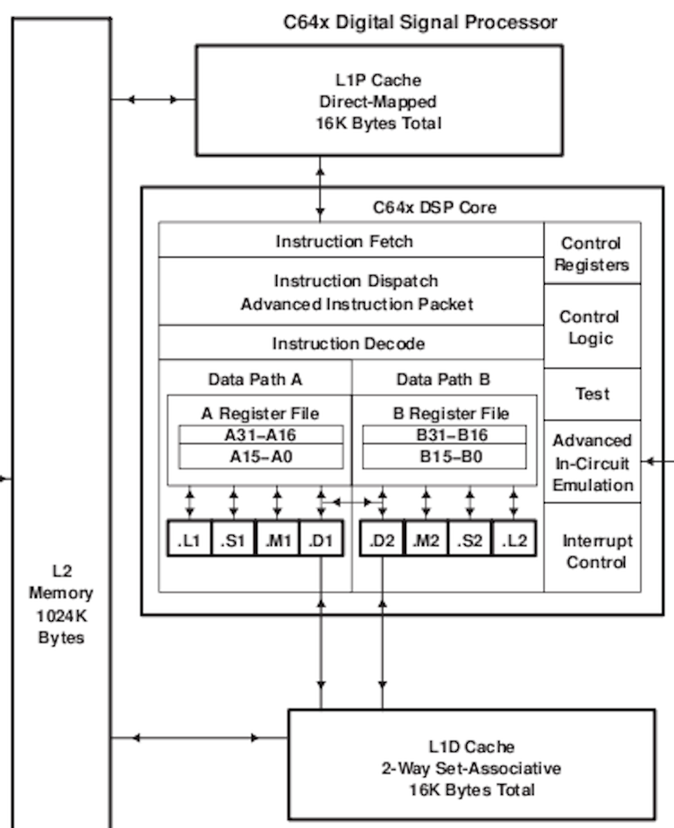
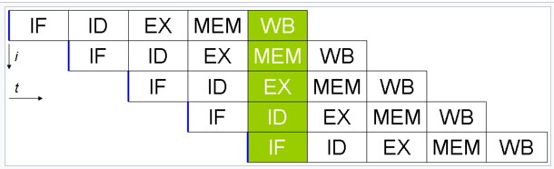
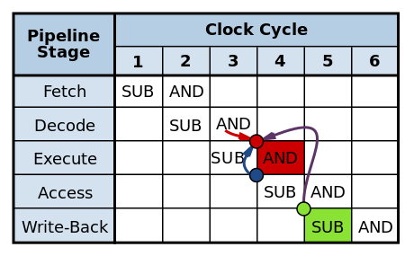
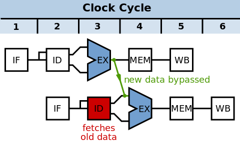

# Branchless programming

How to use modern CPUs effectively


## Early CPU architectures

* Intel 8080
* 5 GP registers
* common instructions 4, 5, 7, 10, or 11 cycles
* CPU clock frequency 2MHz to 3.125MHz


# How to make such beast faster?

* use better MOS technology -> higher CPU clock frequency
* faster execution (fast multiplier), but nothing fancy
* superscalar architecture (multiple execution lines)
* SIMD
    - too much cost (chip area, # transistors)
    - to be used later
* MISD
    - too complicated
* WLIW architecture
    - very efficient
    - needs optimizing compiler
    - not backward compatible
* split instruction execution into multiple stages
    - cost efficient
    - => classic RISC pipeline - 5 stages




## Classic RISC pipeline

* 5 stages
    - instruction fetch
    - instruction decode
    - execute (add, for example)
    - memory access
    - write back (result)




## Classic RISC pipeline

* each stage takes precisely one CPU cycle
* almost fully interleaved
    - 5 stages runs in parallel
* possible 5x speedup on the same MOS technology
    - with almost no increase in # transistors
    - a huge win at the time


## Problems in classic RISC pipeline

* hazards
* branches
    - especially conditional branches!


## Data hazards

* usage of register before previous instruction update the register

```asm
SUB r3,r4 -> r10     ; writes r3 - r4 to r10
AND r10,r3 -> r11    ; writes r10 & r3 to r11
```




## Data hazards

* partial solutions
* register count
    - high number of registers (32, 64 on RISC, compared to 8 in CISC)
    - so compiler can choose registers to avoid hazard
    - not full solution
    - can't deal with multiple CPU revisions (change #stages)
* data forwarding
* pipeline stall circuit
    - adding "bubbles"
    - delays instructions by 1-4 clock cycles
    - can destroy RISC idea almost totally
* register renaming
    - done "on silicon"
    - compatible across CPU revisions
* bypass
    - done "on silicon"
    - compatible across CPU revisions
* instruction reordering
    - done "on silicon"
    - compatible across CPU revisions


## Data forwarding




## Branches

* branches changes PC
* standard branches (+ calls +returns)
    - predictable
    - yet it means that the instruction buffer must be cleared-up
* conditional branches
    - non-predictable in 100%
    - causes pipeline stalls (1-4 clock cycles)


## Conditional branches

* A typical heuristic for C code is that there is a branch, on average, every 7
  instructions


```asm
CMP r0, r1     ; compare content of two registers
BNE non_equal  ; branch if not equal
```


## Conditional branches - solutions

* branch delay slots
* branch prediction
* avoiding branches where possible!


### Branch delay slot

* used in some RISC CPUs
* elegant solution
* done in compile time by compiler
    - AOT
* but it depends a lot on CPU revision!
* two slots example

```asm
LD   r0, 0        ; instruction before jump
JMP  foobar       ; jump
ADD  r0, r1 -> r2 ; first delay slot
SUB  r4, r5 -> r6 ; second delay slot
```

```asm
LD   r0, 0        ; instruction before jump
CALL printf       ; function (subroutine) call
ADD  r0, r1 -> r2 ; first delay slot
SUB  r4, r5 -> r6 ; second delay slot
```

```asm
LD   r0, 0        ; instruction before jump
RET               ; return from subroutine
ADD  r0, r1 -> r2 ; first delay slot
SUB  r4, r5 -> r6 ; second delay slot
```


## Branch prediction

* CPU might try to predict whether the branch will be taken or not
* it won't be and can't be 100% accurate
* but having ~90% accuracy would be ok


## Modern architectures

- 14 to 19 stages
- that's a lot!
- for 16 cores: up to 300 instructions in flight at a time!!!)
- allows faster instruction cycles (3GHz...)
- but pipeline stall costs a lot
    - in theory 19x slower program execution in the worst cache

