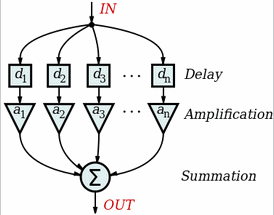
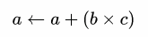
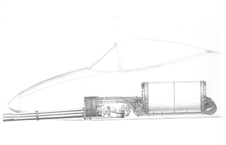
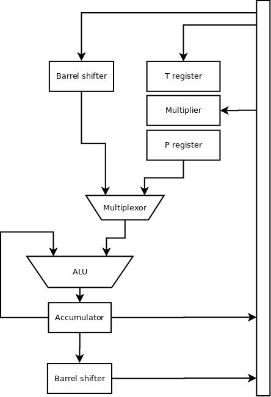
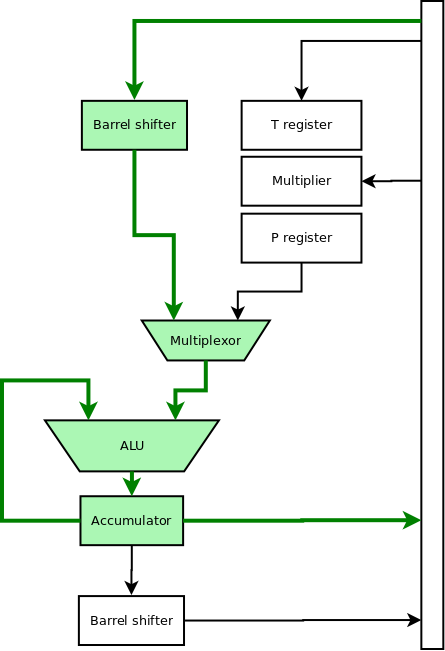
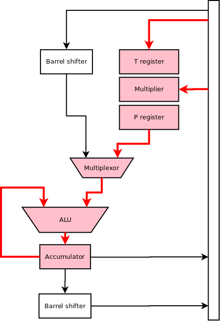
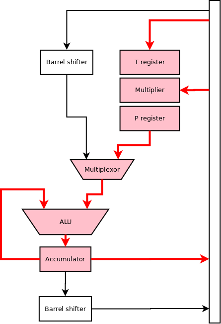
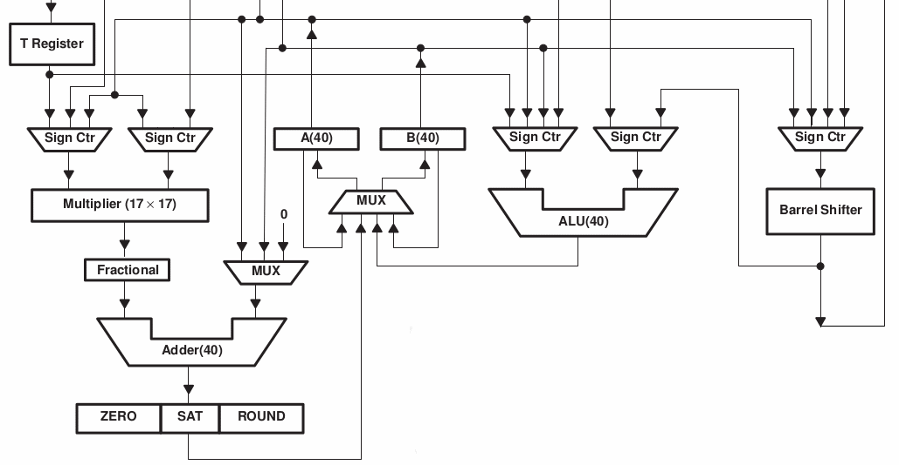

## Digital Signal Processors

* General-purpose CPU versus specialized processing units
* Why?
    - signal processing

### Convolution filter

### FIR

### Discrete Fourier transform

### Discrete cosine transform (JPEG, MPEG, ...)

### Common operations?

* ADD?
* MULtiply?
* MAC -> Multiply Accumulate

### General-purpose vs. specialized

* Thunderbolt is a plane built around gatling gun

* DSP is a chip built around MAC unit
    - multiplier
    - adder
    - accumulator

## TMS32010

* One of 25 most influential chips in human history
    - First OpAmp, 555, CCD, Intel DRAM, MOS 6502, Z80, Intel 8088
* Texas Instruments
* 1982
* Add. Multiply, MAC
* All blocks can run in parallel
* Saturation arithmetic

## TMS32010 internals

* ROM/EPROM 1536 kwords
* RAM 144 kwords
* Stack 4x12 bits
* ALU + 32bit accumulator
* Barrel shifter
* Fast multiplier 16b x 16b -> 32b

## TMS32010 registers

* No general purpose registers!
* Accumulator 32bit
* PC 12bit
* DP 1bit as bank register
* ARP 1bit selects AR0 or AR1 for addressing
* AR0 + AR1 (16b) for addressing
* T (16b) + P (32b) registers are connected to multiplier
    - T: temporary
    - P: product

### Addressing
* Addressing
    - auto increment
    - auto decrement
    - shift by x bites (arrays of different types)
    - change AR0 <-> AR1 for next operation

## More advanced DSPs

## Saturation arithmetic

