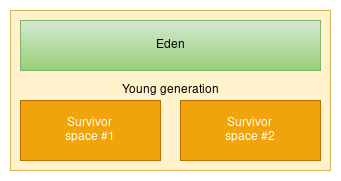
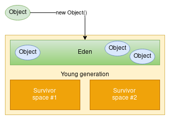
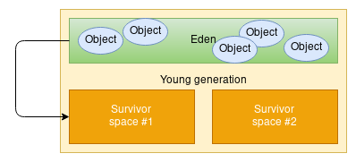
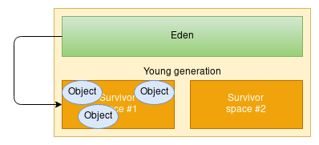

## Garbage collectors

### Reference counting garbage collectors

#### Pros

1. Easy to implement

#### Cons

1. Additional data (field) needed to store reference counter
1. Atomicity of counter changing? -> very slow
1. If counter change is not atomic -> GIL needed instead

### Generational garbage collectors

1. Used in Python VM and in JVM as well
1. Heap is splitted into so called generations
    * 3 generations in Python VM
    * 2 generations in JVM

#### Pros

1. Allocation is for free
1. Deallocation can be started in its own thread or threads

#### Cons

1. Hard to implement (correctly)
1. Stop-the-world full GC is needed sometimes

### Java heap memory model

#### Generations

1. Two generations - young and old
1. Objects are created mainly in young generation

#### Young generation structure

1. Eden space for newly created objects
1. Two survivor spaces

1. Objects are created in eden

1. When eden is full, objects are moved into selected survivor space

1. At the end of this operation, eden is free

#### More speedup possible

1. Thread Local Allocation Buffers (TLAB)
1. Allocation = add a constant to offset pointing to free region
1. Nothing more!
