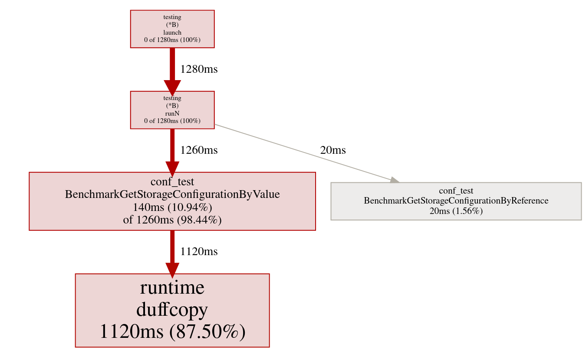
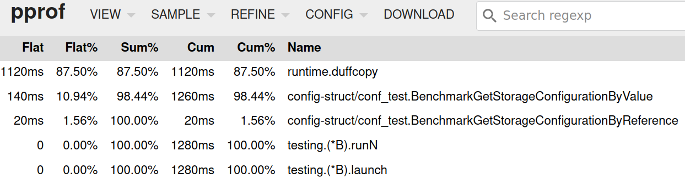
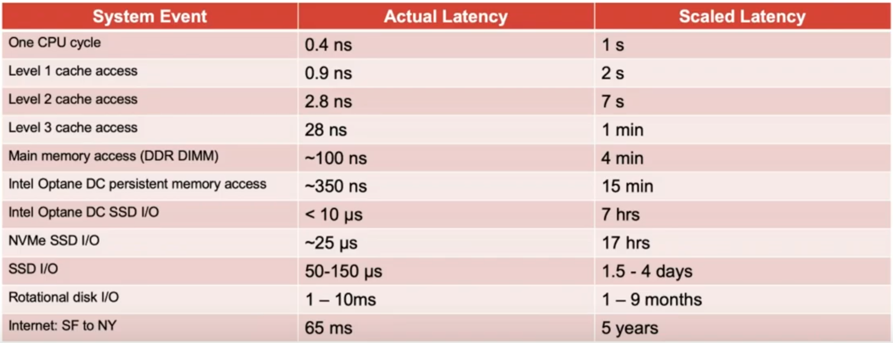

# Trivial performance improvement in Go

## Pass structures by reference, not by value

* All data types are passed by value into functions and methods
    - that's good from "state-space" perspective
    - not so good from performance point of view
    - (and no nice solution like `const` and `mut` exists in Go)

## Problem definition

* Large structures passed by value everywhere in the code
    - even within inner loops
* It causes overhead that is easy to avoid

## Real example

```toml
[logging]
debug = true
log_level = "info"

[kafka_broker]
enabled = true
address = "kafka:29092" #provide in deployment env or as secret
security_protocol = "PLAINTEXT"
cert_path = "not-set"
sasl_mechanism = "PLAIN"
sasl_username = "not-used"
sasl_password = "not-used"
topic = "platform.notifications.ingress" #provide in deployment env or as secret
timeout = "60s"
likelihood_threshold = 0
impact_threshold = 0
severity_threshold = 0
total_risk_threshold = 3
event_filter = "totalRisk >= totalRiskThreshold"

[service_log]
client_id = "a-service-id"
client_secret = "a-secret"
token_url = ""
enabled = false
url = "https://api.openshift.com/api/service_logs/v1/cluster_logs/"
timeout = "15s"
likelihood_threshold = 0
impact_threshold = 0
severity_threshold = 0
total_risk_threshold = 0
event_filter = "totalRisk >= totalRiskThreshold"
rule_details_uri = "https://console.redhat.com/openshift/insights/advisor/recommendations/{module}|{error_key}"

[storage]
db_driver = "postgres"
pg_username = "postgres" #provide in deployment env or as secret
pg_password = "postgres" #provide in deployment env or as secret
pg_host = "localhost" #provide in deployment env or as secret
pg_port = 5432 #provide in deployment env or as secret
pg_db_name = "notification" #provide in deployment env or as secret
pg_params = "sslmode=disable"
log_sql_queries = true

[dependencies]
content_server = "localhost:8082" #provide in deployment env or as secret
content_endpoint = "/api/v1/content" #provide in deployment env or as secret
template_renderer_server = "localhost:8083" #provide in deployment env or as secret
template_renderer_endpoint = "/v1/rendered_reports" #provide in deployment env or as secret

[notifications]
insights_advisor_url = "https://console.redhat.com/openshift/insights/advisor/clusters/{cluster_id}"
cluster_details_uri = "https://console.redhat.com/openshift/details/{cluster_id}#insights"
rule_details_uri = "https://console.redhat.com/openshift/details/{cluster_id}/insights/{module}/{error_key}"
# valid units are SQL epoch time units: months days hours minutes seconds"
cooldown = "24 hours"

[metrics]
job_name = "ccx_notification_service"
# The metrics in Prometheus will be $namespace_$subsystem_$name
namespace = "ccx_notification_service"
subsystem = "to_notification_backend"
gateway_url = "localhost:9091"
gateway_auth_token = ""
retries = 3
# Valid time units are "ns", "us" (or "µs"), "ms", "s", "m", "h".
retry_after = "60s"

[cleaner]
# valid units are SQL epoch time units: months days hours minutes seconds"
max_age = "90 days"

[processing]
filter_allowed_clusters = false
allowed_clusters = []
filter_blocked_clusters = false
blocked_clusters = []
```

## Representation of such structure in Go

```go
type ConfigStruct struct {
	Logging       LoggingConfiguration       `mapstructure:"logging" toml:"logging"`
	Storage       StorageConfiguration       `mapstructure:"storage" toml:"storage"`
	Kafka         KafkaConfiguration         `mapstructure:"kafka_broker" toml:"kafka_broker"`
	ServiceLog    ServiceLogConfiguration    `mapstructure:"service_log" toml:"service_log"`
	Dependencies  DependenciesConfiguration  `mapstructure:"dependencies" toml:"dependencies"`
	Notifications NotificationsConfiguration `mapstructure:"notifications" toml:"notifications"`
	Metrics       MetricsConfiguration       `mapstructure:"metrics" toml:"metrics"`
	Cleaner       CleanerConfiguration       `mapstructure:"cleaner" toml:"cleaner"`
	Processing    ProcessingConfiguration    `mapstructure:"processing" toml:"processing"`
}

type LoggingConfiguration struct {
	// Debug enables pretty colored logging
	Debug bool `mapstructure:"debug" toml:"debug"`
	LogLevel string `mapstructure:"log_level" toml:"log_level"`
}

type StorageConfiguration struct {
	Driver        string `mapstructure:"db_driver"       toml:"db_driver"`
	PGUsername    string `mapstructure:"pg_username"     toml:"pg_username"`
	PGPassword    string `mapstructure:"pg_password"     toml:"pg_password"`
	PGHost        string `mapstructure:"pg_host"         toml:"pg_host"`
	PGPort        int    `mapstructure:"pg_port"         toml:"pg_port"`
	PGDBName      string `mapstructure:"pg_db_name"      toml:"pg_db_name"`
	PGParams      string `mapstructure:"pg_params"       toml:"pg_params"`
	LogSQLQueries bool   `mapstructure:"log_sql_queries" toml:"log_sql_queries"`
}
```

### 'getter' used in the code

```go
func GetStorageConfigurationByValue(configuration ConfigStruct) StorageConfiguration {
	return configuration.Storage
}
```

* Structure is passed by value
* Structure size is about 700 bytes!

### Dirty solution

* the only solution possible in Go
    - different semantic (passing by reference -> struct can be changed within)
* unfortunately we can't distinguish between `const` and `mut`

```go
func GetStorageConfigurationByReference(configuration *ConfigStruct) StorageConfiguration {
	return configuration.Storage
}
```

### Is it worth to do it?

```go
package conf_test

// Benchmark for config module

import (
	"os"
	"testing"

	"config-struct/conf"
)

const (
	configFileEnvVariableName = "CCX_NOTIFICATION_SERVICE_CONFIG_FILE"
	defaultConfigFileName     = "./config"
)

// loadConfiguration function loads configuration prepared to be used by
// benchmarks
func loadConfiguration() (conf.ConfigStruct, error) {
	os.Clearenv()

	err := os.Setenv(configFileEnvVariableName, defaultConfigFileName)
	if err != nil {
		return conf.ConfigStruct{}, err
	}

	config, err := conf.LoadConfiguration(configFileEnvVariableName, defaultConfigFileName)
	if err != nil {
		return conf.ConfigStruct{}, err
	}

	return config, nil
}

func mustLoadBenchmarkConfiguration(b *testing.B) conf.ConfigStruct {
	configuration, err := loadConfiguration()
	if err != nil {
		b.Fatal(err)
	}
	return configuration
}

func BenchmarkGetStorageConfigurationFunctionByValue(b *testing.B) {
	b.StopTimer()
	configuration := mustLoadBenchmarkConfiguration(b)
	b.StartTimer()

	for i := 0; i < b.N; i++ {
		// call benchmarked function
		conf.GetStorageConfigurationByValue(configuration)
	}

}

func BenchmarkGetStorageConfigurationFunctionByReference(b *testing.B) {
	b.StopTimer()
	configuration := mustLoadBenchmarkConfiguration(b)
	b.StartTimer()

	for i := 0; i < b.N; i++ {
		// call benchmarked function
		conf.GetStorageConfigurationByReference(&configuration)
	}

}

```

```
$ go test -bench=. -benchtime=1000000000x -cpuprofile profile.out -v config-struct/conf

goos: linux
goarch: amd64
pkg: config-struct/conf
cpu: Intel(R) Core(TM) i7-8665U CPU @ 1.90GHz
BenchmarkGetStorageConfigurationFunctionByValue
BenchmarkGetStorageConfigurationFunctionByValue-8               1000000000              13.20 ns/op
BenchmarkGetStorageConfigurationFunctionByReference
BenchmarkGetStorageConfigurationFunctionByReference-8           1000000000               0.2405 ns/op
PASS
ok      config-struct/conf      27.166s
```

* That is 5488% speed increase :)




### Is it still relevant

* 0.2405 ns vs. 13.20 ns from CPU point of view vs. human point of view



### What about methods?

* The same issue + simple fix

```go
func (configuration ConfigStruct) GetStorageConfigurationByValue() StorageConfiguration {
	return configuration.Storage
}

func (configuration *ConfigStruct) GetStorageConfigurationByReference() StorageConfiguration {
	return configuration.Storage
}
```

### Benchmark for methods

```go
func BenchmarkGetStorageConfigurationMethodByValue(b *testing.B) {
	b.StopTimer()
	configuration := mustLoadBenchmarkConfiguration(b)
	b.StartTimer()

	for i := 0; i < b.N; i++ {
		// call benchmarked function
		configuration.GetStorageConfigurationByValue()
	}

}

func BenchmarkGetStorageConfigurationMethodByReference(b *testing.B) {
	b.StopTimer()
	configuration := mustLoadBenchmarkConfiguration(b)
	b.StartTimer()

	for i := 0; i < b.N; i++ {
		// call benchmarked function
		configuration.GetStorageConfigurationByReference()
	}

}
```

* Run the benchmark

```
$ go test -bench=. -benchtime=1000000000x -cpuprofile profile.out -v config-struct/conf

goos: linux
goarch: amd64
pkg: config-struct/conf
cpu: Intel(R) Core(TM) i7-8665U CPU @ 1.90GHz
BenchmarkGetStorageConfigurationFunctionByValue
BenchmarkGetStorageConfigurationFunctionByValue-8               1000000000              13.20 ns/op
BenchmarkGetStorageConfigurationFunctionByReference
BenchmarkGetStorageConfigurationFunctionByReference-8           1000000000               0.2405 ns/op
BenchmarkGetStorageConfigurationMethodByValue
BenchmarkGetStorageConfigurationMethodByValue-8                 1000000000              13.24 ns/op
BenchmarkGetStorageConfigurationMethodByReference
BenchmarkGetStorageConfigurationMethodByReference-8             1000000000               0.3596 ns/op
PASS
ok      config-struct/conf      27.166s
```
