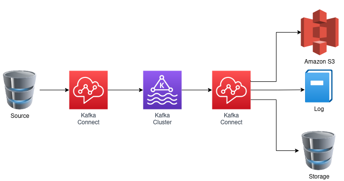

# Kafka Connect framework


## Usage of Kafka

* Message broker on steroids
* Lambda architecture
* Kappa architecture
* Logging platform
* Service mesh communication layer
* and more


## Kafka architecture

* (ZooKeeper)
* Message brokers
* Producers
* Consumers
* DB backends
* and ... connectors


## Kafka Connect

* "Distributed scalable framework"
* Automatic consuming or producing data
    - with data persistence in-between
* Part of Apache Kafka
* Just configuration files
* And connectors


## Kafka Connect

* Sources
* Kafka Cluster
* Sinks


## Use cases

### Moving data from one DB to another one


### Connection between MQTT and AWS SQS


### From one source to various sinks

* Amazon S3
* Logs
* Storage (database)



#### Custom consumers are possible

* Amazon S3
* Logs
* Storage (database)
* And bunch of custom consumers


## Kafka Connect from developers PoV

* Is separate process
* It requires no programming
    - failures handling
    - logging
    - monitoring
    - scaling
    - migrating
    - sec. handling etc.
* Lightweight data transformations


## File sources and sinks

### Schema-less

* `$KAFKA_PATH/config/connect-standalone.properties`

```property
plugin.path=/home/ptisnovs/kafka/kafka_2.12-3.3.2/libs/
```

* `$KAFKA_PATH/config/connect-file-sink.properties`

```propery
name=local-file-sink
connector.class=FileStreamSink
tasks.max=1
file=test.sink.txt
topics=connect-test-1
key.converter=org.apache.kafka.connect.storage.StringConverter
value.converter=org.apache.kafka.connect.storage.StringConverter
key.converter.schemas.enable=false
value.converter.schemas.enable=false
```

* Start the connector

```bash
bin/connect-standalone.sh config/connect-standalone.properties config/connect-file-sink.properties
```

* Produce some messages

```bash
kafkacat -b localhost:9092 -P -t connect-test-1
```

### JSON messages

* `$KAFKA_PATH/config/connect-file-sink-2.properties`

```property
name=local-file-sink-json
connector.class=FileStreamSink
tasks.max=1
file=test.sink.txt
topics=connect-test-2
key.converter=org.apache.kafka.connect.json.JsonConverter
value.converter=org.apache.kafka.connect.json.JsonConverter
key.converter.schemas.enable=false
value.converter.schemas.enable=false
```

## JDBC sink

* Any insert/update/delete as event to Kafka
* Schema needs to be provided!

```property
name=db-sink
connector.class=io.confluent.connect.jdbc.JdbcSinkConnector
tasks.max=1
topics=connect-test-3
key.converter=org.apache.kafka.connect.json.JsonConverter
value.converter=org.apache.kafka.connect.json.JsonConverter
key.converter.schemas.enable=false
value.converter.schemas.enable=false
connection.url=jdbc:postgresql://localhost:5432/kafka_sink?user=postgres&password=postgres
auto.create=true
delete.enabled=false
```


## Useful links

* [Apache Kafka vs. Middleware (MQ, ETL, ESB) – Slides + Video](https://www.kai-waehner.de/blog/2019/03/07/apache-kafka-middleware-mq-etl-esb-comparison/)

* [Discover Kafka® connectors and more](https://www.confluent.io/hub/?_ga=2.197519912.642206306.1675149141-1201563621.1675149140)

* [JDBC Connector (Source and Sink)](https://www.confluent.io/hub/confluentinc/kafka-connect-jdbc)

* [From Zero to Hero with Kafka Connect by Robin Moffatt](https://www.youtube.com/watch?v=Jkcp28ki82k)
