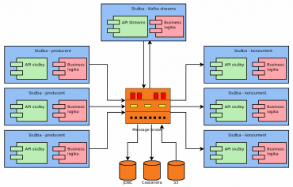

# Monitoring Apache Kafka


## Usage of Kafka

* Message broker on steroids
* Lambda architecture
* Kappa architecture
* Logging platform




## Kafka architecture

* ZooKeeper
* Message brokers

## JMX

* Java Management Extensions
* Standard in Java world for a long time
* Ability to monitor **any** JVM-based application
* Metrics etc. available through *MBeans*
* Standard tool named **jconsole**

(example of **jconsole** usage)

### Simple example of custom MBeans

* MBean definition via interface named `xxxMBean`:

```java
public interface StatusMBean {
    Integer getAnswer();
    String getProgramName();
    Boolean getSwitchStatus();
}
```

* Interface implementation:

```java
public class Status implements StatusMBean {
   private Integer answer;
   private String programName;
   private Boolean switchStatus;

   public Status(String programName) {
       this.answer = 42;
       this.programName = programName;
       this.switchStatus = false;
   }
   
   @Override
   public Integer getAnswer() {
       return this.answer;
   }

   @Override
   public String getProgramName() {
       return this.programName;
   }

   @Override
   public Boolean getSwitchStatus() {
       return switchStatus;
   }
}
```

* MBean export:

```
import java.util.Scanner;

import javax.management.*;
import java.lang.management.ManagementFactory;

public class Main {
   public static void main(String[] args) {
       try {
           String programName = (args.length == 0) ? "foobar" : args[0];

           StatusMBean systemStatus = new Status(programName);

           MBeanServer platformMBeanServer = ManagementFactory.getPlatformMBeanServer();
           ObjectName objectName = new ObjectName("cz.root.app:name=StatusExample");
           platformMBeanServer.registerMBean(systemStatus, objectName);

       } catch (Exception e) {
           e.printStackTrace();
       }

       new Scanner(System.in).nextLine();
   }
}
```

(example of **jconsole** usage)

### JMX can be used to *control* applications as well

* MBean definition via interface named `xxxMBean`:

```java
```

* Interface implementation:

```java
```

* MBean export:

```java
```

(example of **jconsole** usage)

