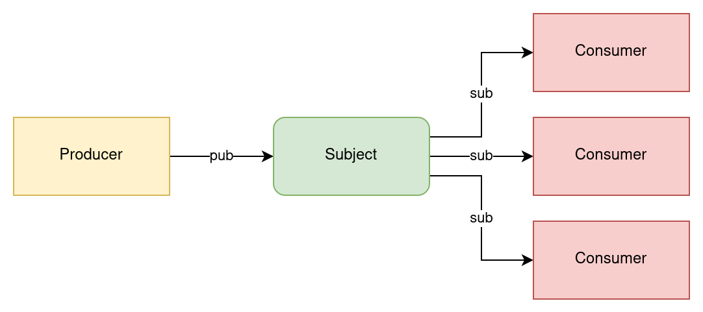
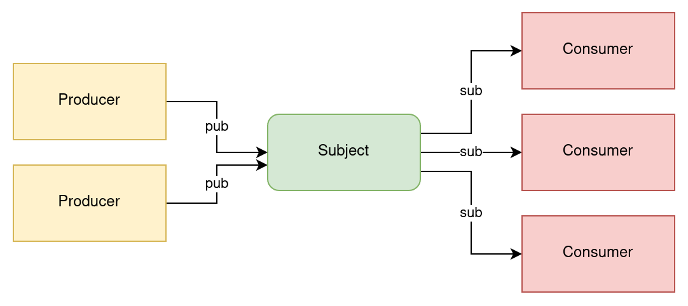
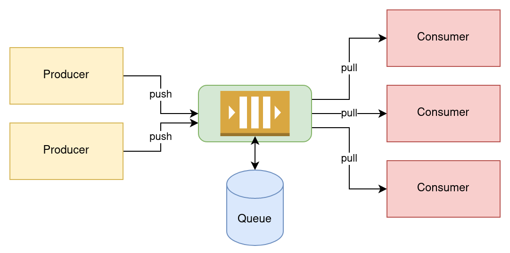
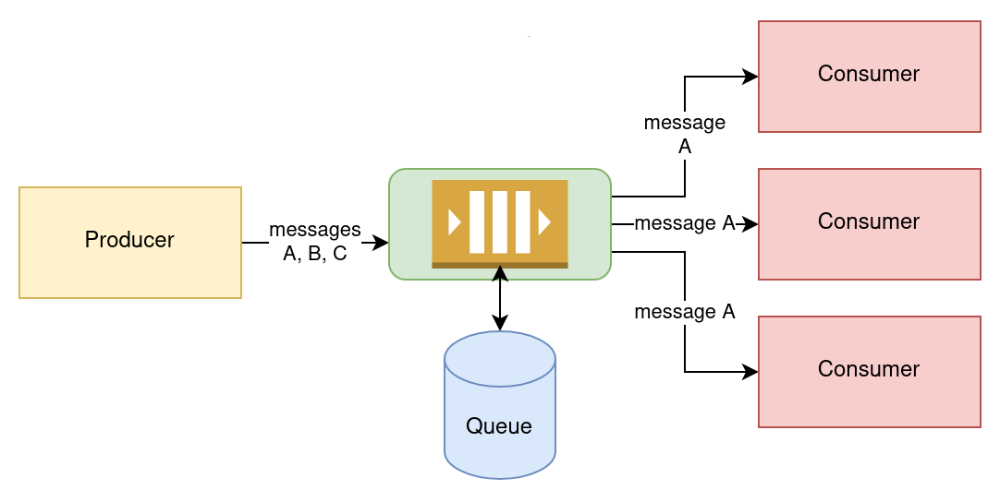
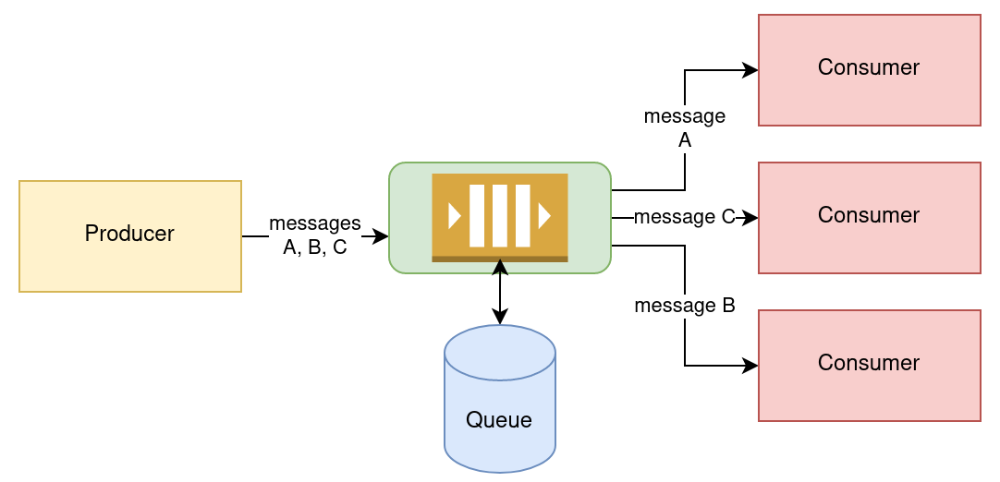
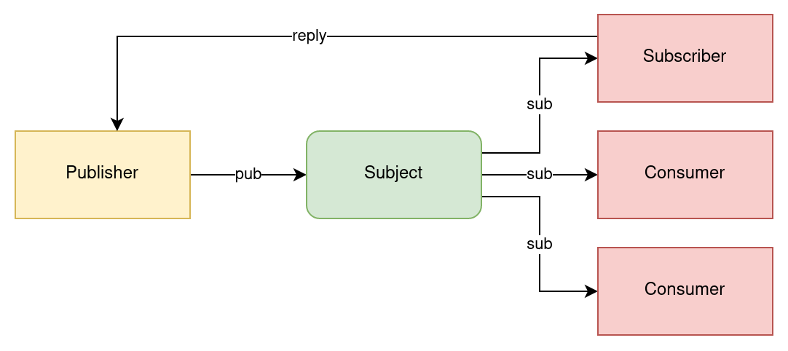
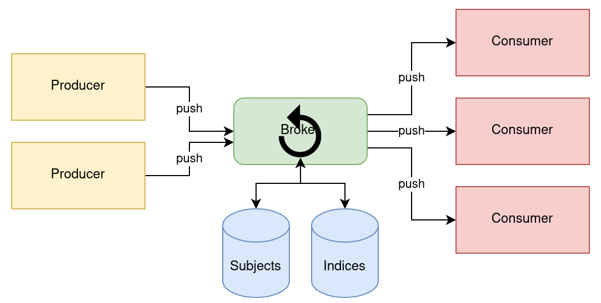
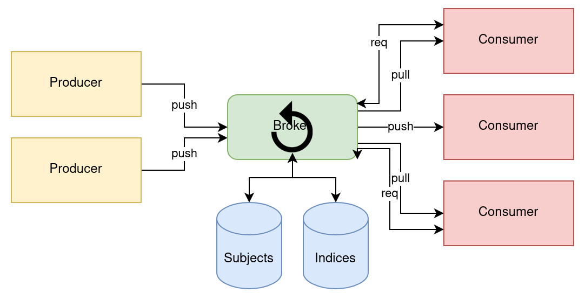

# NATS and JetStream

## Intro

* Scalable and resilient message broker
* Written in Go programming language
    - Initial version written in Ruby (Derek Collison)
    - Then rewritted into Go
        - just one executable
        - started much faster than `java -version` :)
* Based on multiple cooperating components
* No single point of failure

## NATS components

* Server
    - `gnatsd` previously
    - `nats-server` today
* Interfaces for various ecosystems
* Streaming support
    - NATS Streaming Server (previously)
    - JetStream as modern variant
* NATS Connector Framework

## NATS ecosystems support

### Official

1. C
1. C#
1. Elixir
1. Go
1. Java
1. NGINX
1. Node.js
1. Python Asyncio
1. Python Tornado
1. Ruby
1. TypeScript

### Unofficial

1. .NET
1. Arduino
1. Clojure
1. Elm
1. Erlang
1. Haskell
1. Lua
1. MicroPython
1. PHP
1. Perl
1. Python
1. Python Twisted
1. Qt5 C++
1. Rust
1. Scala
1. Spring API
1. Swift

## Communication strategies

* pub-sub
    - using *subjects* (similar to *topics*)
* push-pull (via queues)
* request-reply
    - point-to-point
    - one-to-many
    - (based on *inbox* for replies)
* streaming
    - with ability to "replay" messages
    - various retention and delivery policies
    - subscribers' offsets stored on server
        - (no Kafka madness with ZooKeeper etc.)
* key/value store
* object store

## Overview of communication strategies

### pub-sub communication pattern



### Multiple producers to given subject



### push-pull communication pattern via queue



### All consumers work concurrently with same messages



### Round-robin approach / load balancing



### request-reply communication pattern



### Streaming: push-push communication pattern



### Streaming: push-pull communication pattern



## Quality of service

* At most once QoS
* At-least / exactly once QoS
* 1, 3, or 5 replicas
    - 2 and 4 possible too, but it does not make much sense

## Protocol used by NATS

* text-based
    - but data can be binary
* possible to test it via *telnet*

```
Command   send by
INFO      server
CONNECT   client
PUB       client
SUB       client
UNSUB     client
MSG       server
PING      client and server
PONG      client and server
+OK       server
-ERR      server
```

## Communicating with NATS

### Live demo

```
cd /tmp/ramdisk/nats-0.0.34-linux-amd64/

./nats server run --jetstream

export PS1=$\ 

cd /tmp/ramdisk/nats-0.0.34-linux-amd64/

./nats stream create foo

./nats stream create bar

./nats stream rm foo

./nats stream rm bar

./nats stream ls

./nats stream create user-add-operation

./nats stream create user-delete-operation

./nats stream ls

./nats pub user.alice.add "Alice added"

./nats pub user.bob.add "Bob added too"

./nats pub user.clayton.delete "Clayton deleted"

./nats pub user.random.add "User #{{.Count}}" --count=10

./nats sub --stream user-add-operation

./nats sub --stream user-add-operation --last

./nats sub --stream user-add-operation --new
```

## Appendix

### Links

* [About NATS](https://nats.io/about/)
* [Slides about NATS](https://www.slideshare.net/nats_io/presentations)
* [NATS comparison](https://docs.nats.io/nats-concepts/overview/compare-nats)

### Czech articles about NATS

* [Komunikace s message brokery z programovacího jazyka Go](https://www.root.cz/clanky/komunikace-s-message-brokery-z-programovaciho-jazyka-go/#k15)
* [Použití message brokeru NATS](https://www.root.cz/clanky/pouziti-message-brokeru-nats/)
* [NATS Streaming Server](https://www.root.cz/clanky/nats-streaming-server/)

