# Patterns in IT, importance of notation, and the APL programming language

---

## Pattern

* a regularity in the world
* in human-made design
* or in abstract ideas

---


---


---


---

### Patterns in IT

* Why?
    - general, reusable solution
* Multiple levels
    - common idioms, notation, code structure, algorithms
    - SW design patterns (by Gang of Four)
    - enterprise integration patterns

---

### SW design patterns

* General, reusable solution to a commonly occurring problem
* Not a finished design that can be transformed directly into source or machine code
    - A description or template for how to solve given problems
* Formalized best practices that the programmer can use to solve common problems

---

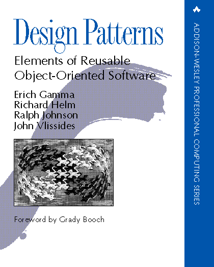

---

### Enterprise integration patterns

* To help developers design and build distributed applications or integrate existing ones
* Provide a technology-independent vocabulary and visual notation taken from proven solutions to recurring problems
* Also share common "gotchas" and design considerations
* Fully suported by Apache Camel
    - [https://camel.apache.org/components/3.17.x/eips/enterprise-integration-patterns.html](https://camel.apache.org/components/3.17.x/eips/enterprise-integration-patterns.html)

---


---

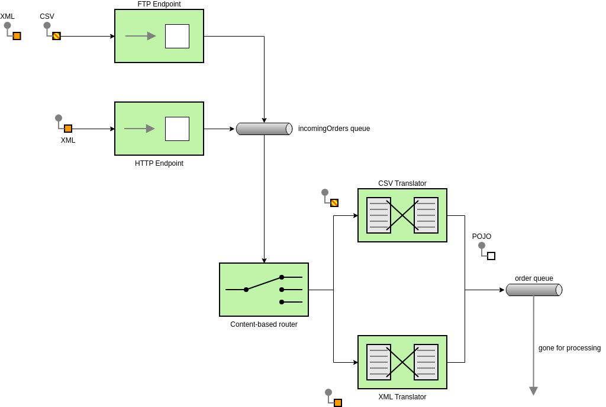

---

### Common idioms, notation, code structure, algorithms

* Everyday's programmers tasks
* Depends on ecosystem
    - idioms in Java are different from Go, ...
* Algorithms are usually not well formalized on source level
    - just "hidden" in libraries and macros
    - this is where notation became very important

---

## Notations

* Notation is a system of
    - graphics or symbols
    - characters
    - abbreviated expressions

---

## Notation

* a collection of related symbols
    - that are each given an arbitrary meaning
    - created to facilitate structured communication
    - within a domain knowledge or field of study!

---

## Symbols
* mark, sign, word
* indication
* is understood as representing an idea, object, or relationship
* pictorial/associative/abstract/conceptual
* stop sign, arrow

---

### Why?

* human brain is excellent in recognizing patterns
* and can be train to recognize new set of patterns
* **Notation as a tool of thought**

---

### Examples of notations

* Music notation
* Chemistry notations (a lot of in fact)
* Chess moves notation
* Feynman diagrams
* etc.

---

#### Music notation

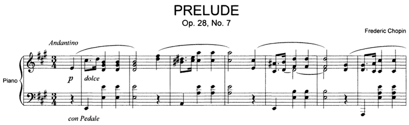

---

#### Chemistry notation

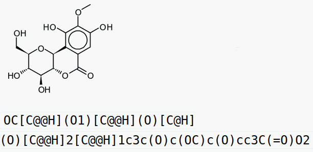

---

#### Traffic

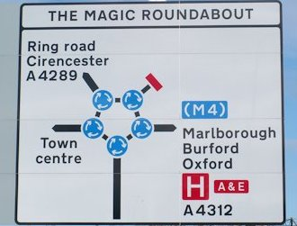

---

#### Maps

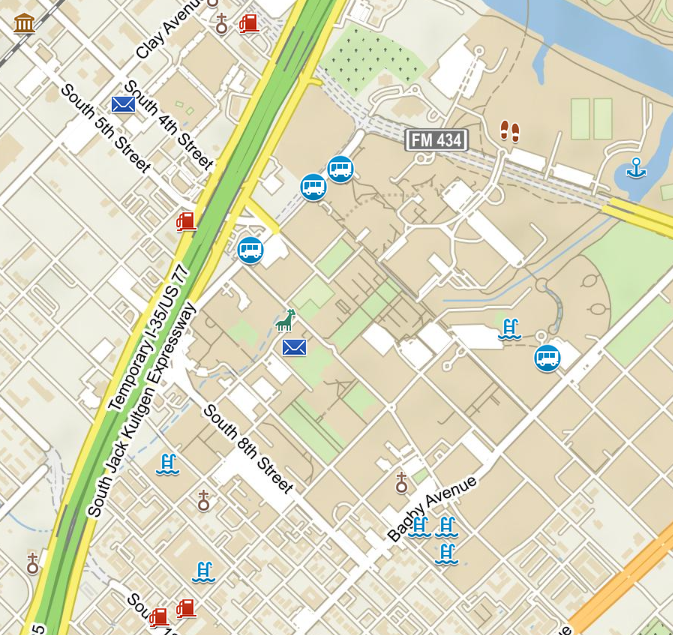

---

#### Math

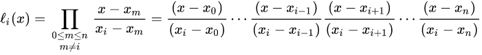

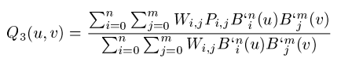

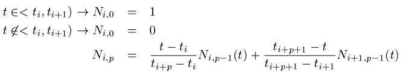

---

#### Chess moves notation

```
♘f3 ♞c6
♗xc6 dxc6
0-0 ♝xc3
```

---

## Notatation in classic programming languages

* i.e. almost all languages with some exceptions
* most are based on "1.5D" text flow
   - from left to right
   - from top to bottom
* usually just basic ASCII characters are used
* linear text - from speech where it make sense
* a lot of context everywhere!

---


---

### Exceptions

* Fortress
    - rendered via LaTeX

---

* Algol 68 Report
    - ∧, ∨
    - ×, ÷, ÷×, ÷*, %×
    - ≤, ≥, ≠, ¬=
    - →, ○, ¢, ⏨, □
    - ×:=, ÷:=, ÷×:=, ÷*:=,  %×:=
    - ¬, ↑, ↓, ⌊, ⌈, ⊥
    - ⊂, ≡, ␣, ⊃, ⎩, ⎧

---

* Epigram
    - "2D" blocks
    - rendered via LaTeX

---


### Examples

---

#### Algol

```algol
¢ this is a comment
real avogadro = 6.0221415⏨23
```

---

#### Epigram

```epigram
     (         !       (          !   (  n : Nat  !
data !---------! where !----------! ; !-----------!
     ! Nat : * )       !zero : Nat)   !suc n : Nat)
```

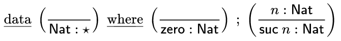

---

```
plus x y <= rec x {
  plus x y <= case x {
    plus zero y => y
    plus (suc x) y => suc (plus x y)
  }
}
```

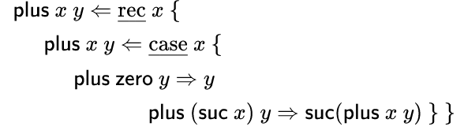

---

#### Fortress

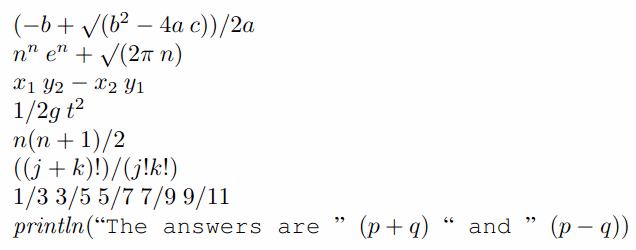

---

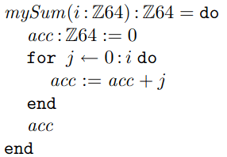

---

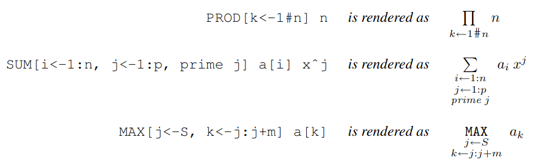

---

## Notation-first language

---

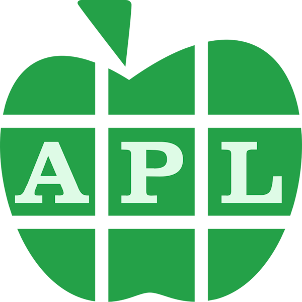

---

## APL programming language

* "A Programming Language"
    - impossible to come with shorter term :)

---

### Origins of APL

* Kenneth E. Iverson
* it was invented as new form of mathematical notation
    - when teaching mathematics at Harvard,
    - "Mathematical notation to express computation"
* during his work for IBM (yes, IBM!) it was translater into aprogramming language
* in 1979, Iverson received the Turing Award for his work on APL
* "A shocking brevity"
* "It is a lot easier to find your errors in four lines of code than in four hundred."

---

### Origins of APL (cont.)

* Common idioms are to be recognized in no time
    - like quadratic formula
* later IBM discouraged customers from using it
    - (but was used a lot by many IBM departments at the same time)
    - prefer to use languages based on "methodologies"
    - basically to split design, analytics, development, and testing
    - OTOH IBM was almost never good at PL design
* btw how they made money
    - $1 for one CPU second
    - $1 for 1kB of output

---

### Welcome to Egypt

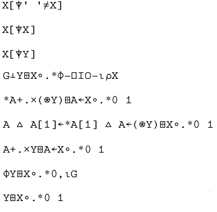

---

### Kenneth E. Iverson

* IBM Fellow, IBM, 1970
* Harry H. Goode Memorial Award, IEEE Computer Society, 1975
* Member, National Academy of Engineering (USA), 1979
* Turing Award, Association for Computing Machinery, 1979
* Computer Pioneer Award (Charter recipient), IEEE Computer Society, 1982
* Honorary doctorate, York University, 1998
* ”Meeting Ken Iversion could cause mental transformations.”

---

### "Array languages"

* An array:
    - rectangular collection of numbers, characters and arrays
    - arranged along zero or more axes

---

### APL today

* APL developers
    - any kind of engineer other than a software engineer
    - do not feel comfortable discussing "programming"
    - i.e. not visible much on SO etc.
    - they generally hate software fashion waves
    - (Dyalog CTO Morten Kromberg)
* Fintec
    - Realtime trading
* Insurance companies
* Big data processing

---

## Feel of APL

* Vectors
* Functions
    - monadic
    - dyadic
* Operators
    - reduce
    - scan
    - inner product
    - outer product

---

* Combinators ("trains")
    - atop
    - fork

---

## Feel of APL

* Functions (operator-like)

```
      monadic               dyadic
+     identity              addition
-     negation              subtraction
×     sign                  multiplication
÷     1/x                   division
ι     counter
⌹     matrix inversion      matrix division
⍉     matrix transposition
⌽     reverse               rotation
↑                           take
↓                           drop
```

* Operators

```
/       reduce
\       scan
.       inner product
◦.      outer product
```

---

### Expressions

* Written using functions

```apl
1+2×3
```

* From right to left, no priorities

```apl
2×3+1
```

---

### Vectors

* Elementary data type in APL
    - Written without commas and other special symbol

```apl
⍴ 1 2 3 4

VECTOR ← 1 2 3 4 5 6
⍴VECTOR

EMPTY_VECTOR ← ι0
```

---

### Selectors

* Selectors are also vectors!

```apl
VECTOR[3]
VECTOR[1 3 5]

'xenobiotic'[10 10 1]
```

---

### Vector constructor

* Vector containing 1, 2, 3, 4 .. 10

```
ι10
```

---

### Vector shape

* Vector shape is ... vector, of course

```apl
⍴ 1 2 3 4
⍴ι10
```

---

### Reshape, matrices

* Dyadic ⍴ is *reshape* function
    - left argument: shape (vector)
    - right argument: vector or matrix

```apl
2 2 ⍴ 1 2 3 4
```

---

### Matrices

* "vector of vectors"
    - *shape*
    - *dimension(s)*

```apl
4 3 ⍴ ⍳12

Mat ← 3 3 ρ ι 9
Mat[2;2]
```

---

### Vector and matrices operations

* Item-by-item operations
    - *broadcasting*

```apl
÷1 2 3 4 5
10÷1 2 3 4 5
```

---

### Reduce operator

* Combined with any dyadic function

```apl
+/ 1 2 3 4
```

---

### Reduce usage

* Calculate sum of all integers ranging from 1 to 100

```apl
+/ι100
```

* Factorial computation

```apl
*/ι100
```

---

* Factorial function
    - monadic function has only one parameter ⍵
    - dyadic function has two parameters ⍺ and ⍵
    - factorial is typical monadic function

```apl
fact←{×/⍳⍵}
fact 10
```

* Average

```apl
X ← 1 2 3 4 5
(+/X)÷⍴X
```

---

### Scan operator

* like *reduce*
    - but returns all intermediate results

```apl
+\ 1 2 3 4 5
```

* Vector of factorials from 1! to 10!

```apl
×\⍳10
```

---

### Each operator

```apl
fact←{×⌿⍳⍵}
fact¨ 10 20 1 0 2
```

---

### Take and drop functions

```apl
vector ← ι10
1 ↑ vector
1 ↓ vector
```

* Absolute and relative change computation

```apl
revenues ← 56 59 67 64 60 61 68 73 78 75 81 84
(1↓revenues)-(¯1↓revenues)
100×((1↓revenues)÷(¯1↓revenues))-1
```

---

### Outer product

* very powerful operation
    - left argument
    - outer product symbols ∘.
    - function (like ×)
    - right argument

```apl
(⍳5)∘.×(⍳5)
(⍳5)∘.=(⍳5)
(⍳5)∘.<(⍳5)
(⍳5)∘.≥(⍳5)
```

* letter frequency computation

```apl
'abcd' ∘.= 'cabbage'
+/ 'abcd' ∘.= 'cabbage'
```

---

### Prime number generator (step-by-step)

* Find all prime numbers from 1 to x
* Well let's start with the final not-idiomatic form

```apl
(∼R∈R∘.×R)/R←1↓⍳x
```

* insane?
   - let's do it step by step

---

### Prime number generator step-by-step

```apl
⍳x
1↓⍳x
R←1↓⍳x
R∘.×R
R∊R∘.×R
~R∊R∘.×R
(~R∊R∘.×R)/R
```

---

* Number of primes in given range

```apl
⍴(~R∊R∘.×R)/R
```

* As a function

```apl
primes←{ {(~⍵∊⍵∘.×⍵)/⍵}1↓⍳⍵}
      primes 10
2 3 5 7
```

---

### Point-free style in APL

* Tacit variant
   - without usage of ⍵
   - without variable R

```apl
((⊢~∘.×⍨)1↓⍳)100
2 3 5 7 11 13 17 19 23 29 31 37 41 43 47 53 59 61 67 71 73 79 83 89 97
```

--

## Point-free style programming

* Programming paradigm in which function definitions do not identify the arguments
* Definitions just compose other functions by combining them
* Combinators
     - manipulate the arguments
* Introduced in J
* Now part of modern APL

---

###  Monadic functions

```apl
      -10
¯10

      ÷10
0.1

      |10
10

      |¯10
10
```

---

### Passing result to other monadic function

```apl
      |(÷(-3))
0.3333333333
```

* Can be shortened to

```apl
      |÷-3
0.3333333333
```

* Btw APL is an array language, so

```apl
      -÷⍳10
¯1 ¯0.5 ¯0.3333333333 ¯0.25 ¯0.2 ¯0.1666666667 ¯0.1428571429 ¯0.125 ¯0.1111111111 ¯0.1
```

---

### From functions to trains

* Function defined using classic style

```apl
      bar ← {-÷|⍵}

      bar 3
¯0.3333333333
```

* Point-free style

```apl
      baz ← -(÷|)

      baz 3
¯0.3333333333
```

---

### S-combinator

* Commonly used pattern in many algorithms:

```apl
(⍺ f ⍵) g (⍺ h ⍵)
```

- or in Python/Go/C>

```c
g(f(⍺, ⍵), h(⍺, ⍵))
```

* **⍺** - parameter passed to function **f** and **h**
* **⍵** - parameter passed to function **f** and **h**
* **f** is dyadic function 
* **h** is dyadic function 
* **g** is dyadic function

---

### S-combinator

* It's possible to shorten it to

```apl
(f g h)
```

- or even to

```apl
fgh
```

---

### S-combinator example

* Initial expression:

```apl
(⍳10) ∘.× (⍳10)

 1  2  3  4  5  6  7  8  9  10
 2  4  6  8 10 12 14 16 18  20
 3  6  9 12 15 18 21 24 27  30
 4  8 12 16 20 24 28 32 36  40
 5 10 15 20 25 30 35 40 45  50
 6 12 18 24 30 36 42 48 54  60
 7 14 21 28 35 42 49 56 63  70
 8 16 24 32 40 48 56 64 72  80
 9 18 27 36 45 54 63 72 81  90
10 20 30 40 50 60 70 80 90 100
```

* Can be shortened to:

```apl
(⍳∘.×⍳)10
```

---

### Multiplication table

* Put it into the function:

```apl
multiplicationTable ← ⍳∘.×⍳
```

- that's really it!

* Check it:

```apl
multiplicationTable 10
```
---

## Implementations of APL

* Dyalog APL
* GNU APL
* ngl/apl
* NARS2000

---

## Links

* [APL Wiki](https://aplwiki.com/wiki/)
* [The Array Cast](https://www.arraycast.com/episodes/episode-03-what-is-an-array)
* [EnthusiastiCon 2019 – An Introduction to APL](https://www.youtube.com/watch?v=UltnvW83_CQ)
* [Dyalog](https://www.dyalog.com/)
* [Try APL!](https://tryapl.org/)
* [APL na replit](https://replit.com/languages/apl)
* [Advent of Code 2020 in APL!](https://www.youtube.com/watch?v=0RQFW6P1Tt0)
* [Python vs APL (1 Problem)](https://www.youtube.com/watch?v=APdKFJkmBbM)
* [APL Wins (vs C++, Java & Python)](https://www.youtube.com/watch?v=59vAjBS3yZM)
* [A Tour de Force of APL in 16 Expressions by Roger Hui](https://www.youtube.com/watch?v=e0rywC7-i0U)
* [Conway's Game Of Life in APL](https://www.youtube.com/watch?v=a9xAKttWgP4)
* [A List of companies that use Array Languages (J, K, APL, q)](https://github.com/interregna/arraylanguage-companies)
* [APL - one of the greatest programming languages ever](http://www.vaxman.de/publications/apl_slides.pdf)
* ["The J Programming Language" by Tracy Harms (2013)](https://www.youtube.com/watch?v=RWYkx6-L04Q)
* [Dyalog Modern Programming Language, Morten Kromberg, Talks at Google](https://www.youtube.com/watch?v=PlM9BXfu7UY)
* [The J Language: Consistency, Adjacency, and Solution-Oriented Programming - Tracy Harms](https://www.youtube.com/watch?v=gLULrFY2-fI)
* [Un-directed programming](https://www.sacrideo.us/un-structured-programming/)
* [Pattern](https://en.wikipedia.org/wiki/Pattern)
* [Enterprise Integration Patterns](https://www.enterpriseintegrationpatterns.com/)
* [Enterprise Integration Patterns](https://camel.apache.org/components/3.17.x/eips/enterprise-integration-patterns.html)
* [Impending kOS](https://vector.org.uk/impending-kos/)
* [APL Primitives](https://www.microapl.com/apl_help/ch_020_020.htm)
