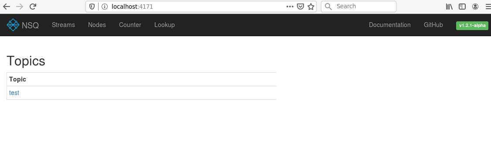

# NSQ


## Intro

## Architecture

* directory service
    - other nodes have to register there
    - usually more directory services run at the same time
    - good idea to register to more directory services
* NSQ daemons
    - used to receive, store, and send messages
    - messages are persistent, i.e. are stored during restart
    - possible to use multiple NSQ daemons to handle the same message
* web admin interface
    - communicates with directory services
    - also with NSQ daemons if needed



## Components

* `nsqd`
* `nsqlookupd`
* `nsqadmin`
* utilities
* client libraries

### `nsqd`

### `nsqlookupd`

### `nsqadmin`

### Utilities

### Client libraries

```
go-nsq                Go
pynsq                 Python
nsqjs                 JavaScript
elixir_nsq            Elixir
ensq                  Erlang
nsq-j                 Java
JavaNSQClient         Java
TrendrrNSQClient      Java
nsqjava               Java
nsq.js                JavaScript
node-nsqueue          JavaScript
knsq                  Kotlin
NsqSharp              .NET
php-nsq               PHP
phpnsq                PHP
nsqphp                PHP
nsq-py                Python
gnsq                  Python
krakow                Ruby
ruby_nsq              Ruby
evnsq                 C++
libnsq                C
hsnsq                 Haskell
nsq-java              Java
nsq-client            JavaScript
NSQnet                .NET
perl-anyevent-nsq     Perl
NsqSpinner            Python
nsq-ruby              Ruby
uvnsq                 C++11
nsq-clojure           Clojure
nsqie                 Scala
nodensq               JavaScript
nsqueue               Rust
asyncnsq              Python
nsq-ocaml             OCaml
node-red-contrib-nsq  NodeRED Nodes
asyncnsq              Rust
tokio-nsq             Rust
ansq                  Python
```

## Topology patterns

## Building and running

### Nsq compiling

```
$ git clone https://github.com/nsqio/nsq
 
Cloning into 'nsq'...
remote: Enumerating objects: 18, done.
remote: Counting objects: 100% (18/18), done.
remote: Compressing objects: 100% (17/17), done.
remote: Total 11117 (delta 2), reused 7 (delta 1), pack-reused 11099
Receiving objects: 100% (11117/11117), 12.18 MiB | 505.00 KiB/s, done.
Resolving deltas: 100% (6658/6658), done.
Checking connectivity... done.
```

## Links

### NSQ documentation

* [A realtime distributed messaging platform](https://nsq.io/)
* [NSQ Topology Patterns](https://nsq.io/deployment/topology_patterns.html)

### Presentations about NSQ

* [Realtime Distributed Message Processing at Scale with NSQ](https://www.youtube.com/watch?v=IkU8JsxdCAM)

### Czech articles about NSQ

* [NSQ – systém pro doručování zpráv bez centrálního message brokera](https://www.root.cz/clanky/nsq-system-pro-dorucovani-zprav-bez-centralniho-message-brokera/)
* [NSQ – systém pro doručování zpráv bez centrálního message brokera (dokončení)](https://www.root.cz/clanky/nsq-system-pro-dorucovani-zprav-bez-centralniho-message-brokera-dokonceni/)

### Other links

* [Idempotence (Wikipedia)](https://en.wikipedia.org/wiki/Idempotence)
