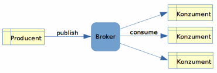
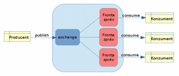
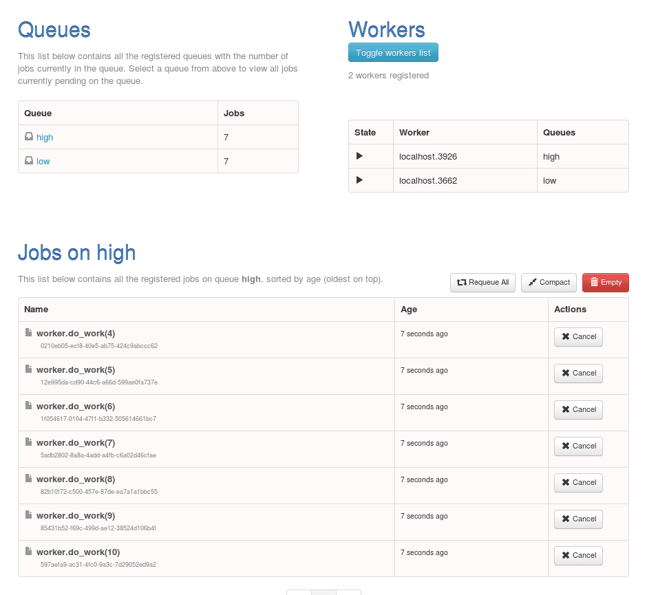
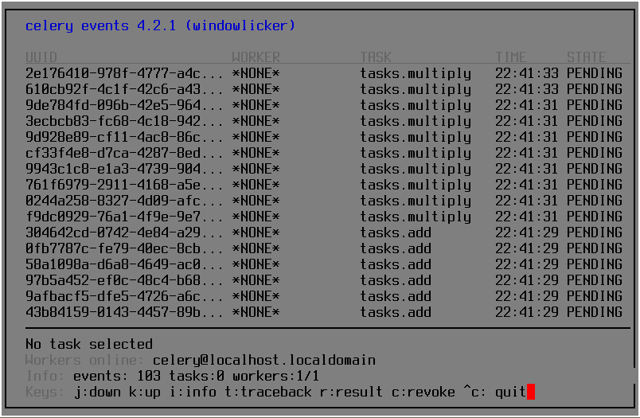

## Message brokers

### Message brokers and message queues

* Transfer messages between various sources and targets
* Usually two modes
    * Push-pull with queue
    * Pub-sub with more targets (subscribers)

#### Why message brokers

* Standardization (protocols etc.)
* Fully asynchronous communication
* Ability to decouple things apart
* Ability to specify data streams explicitly
* Persistence of messages
* Ability to scale sources/targets independently
* Redundancy possible
* Load-balancing
* Resiliency
* Avoid using M:N connections - change to M:1 and 1:N

#### Push-pull

* More workers, just one receives the message
* Round-robin
* B2B


#### Pub-sub

* More receivers, all receive the message
* Receiver must be connected on time
* IoT etc.



#### Push-pull model with exchange

* Ability to create more complicated pipelines



### Message queue

* More queues in message broker
* Queues have names
* Two basic operations
    * enqueue
    * dequeue
* Special modes
    * priority queues
    * DLQ (Dead Letter Queue)
    * Time to be delivered
    * TTL in messages

### Topic

* In pub-sub
* Text label assigned to message
* Can be hierarchical!
    * Regions etc.
* Rules for routing messages

### Protocols

* AMQP
    - Advanced Message Queuing Protocol
* STOMP
    - Streaming Text Oriented Messaging Protocol
* MQTT
    - Message Queuing Telemetry Transport)
* CoAP
    - Constrained Application Protocol
* WAMP
    - Web Application Messaging Protocol

### Message brokers implementations

* Redis Queue (RQ)
* RabbitMQ
* Apache Active MQ
* Celery

### Redis Queue

* Based on Redis
* Simple controlling from Python
* DLQ support



#### Redis Queue (RQ) - producer

```python
from redis import Redis
from rq import Queue
  
from worker import do_work
  
q = Queue(connection=Redis())
  
for i in range(10):
    result = q.enqueue(do_work, i)
    print(result)
```

#### Redis Queue (RQ) - consumer

```python
from time import sleep
  
def do_work(param):
    print("Working, received parameter {}".format(param))
    # simulace práce :-)
    sleep(2)
    print("Done")
```

#### Redis Queue (RQ) - start the worker

```bash
$ rq worker
```

### RabbitMQ

* The most advanced message broker
* Written in Erlang
* Priority queues possible
* Interfaces for various languages
    - Java
    - JavaScript (Node.js)
    - Python
    - Ruby
    - PHP
    - C#
    - Go
    - Elixir
    - (Java) Spring AMQP
    - Swift
    - Objective-C
    - Clojure
* Ability to configure fan-out


#### Celery

* For Python (the same as for RQ)
* More flexible than RQ
* Monitoring etc.
* Remote control for workers



