# Rust programming language

* Pavel Tišnovský, Red Hat
    - `ptisnovs@redhat.com`
* Presentation:
    - [https://tisnik.github.io/presentations/coffee-talks/rust.html](https://tisnik.github.io/presentations/coffee-talks/rust.html)
* Presentation source:
    - [https://github.com/tisnik/presentations/blob/master/docs/coffee-talks/rust.md](https://github.com/tisnik/presentations/blob/master/docs-coffee-talks/rust.md)


---

## Table of content

* Requirements to production-ready programming language
* Rust popularity and expansion
* Rust characteristics
* Rust versus C/C++
* Rust versus Go
* Communication with compiler
* Data types
* Other interesting parts of Rust
* Object oriented programming in Rust
* Memory management
* Threads
* Testing
* Package manager (Cargo)
* Selected useful packages
* Deployment
* Interface to Python
* Documentation

---

## Requirements to production-ready programming language

* Program correctness
* Maintainability
* Safety
* Stability of language ecosystem
* Enough developers
* Resource requirements
    - More RAM needed -> more expenses in containerized world
* API and ability to communicate with (micro)services

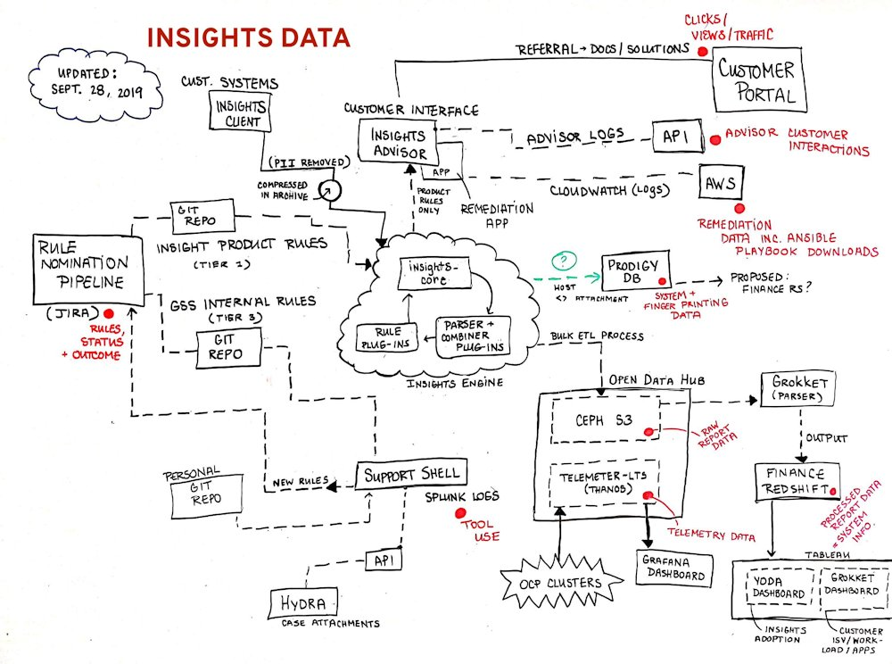

---

## Rust popularity and expansion

### Popularity of Rust

* More metrics how to measure popularity
    - Tiobe index
    - PYPL (PopularitY of Programming Languages)
    - OpenHub (for registered repositories only)
    - StackOverflow (yearly interrogatory)

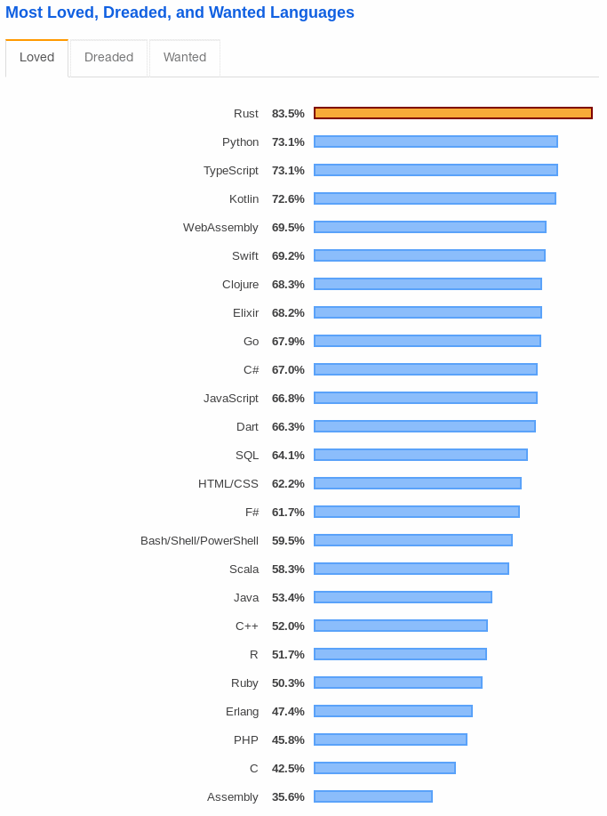

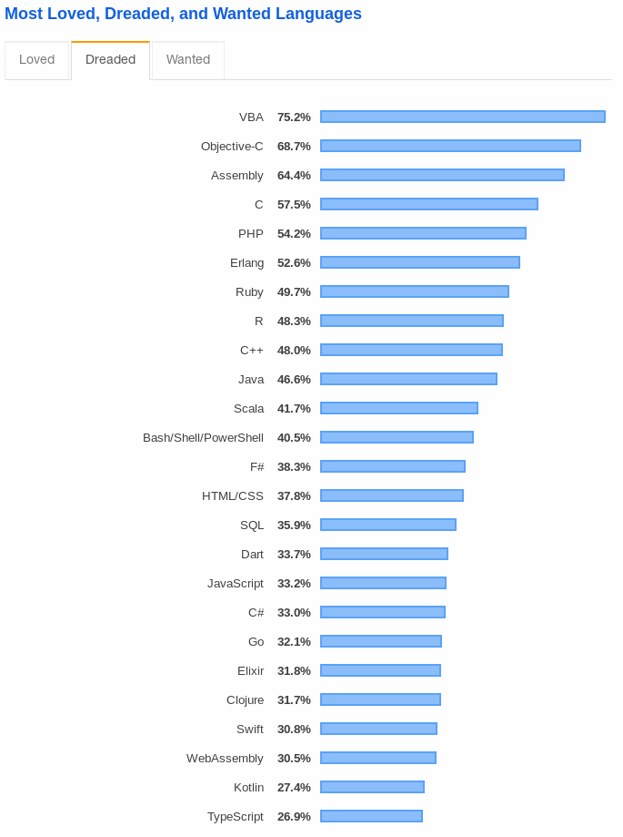

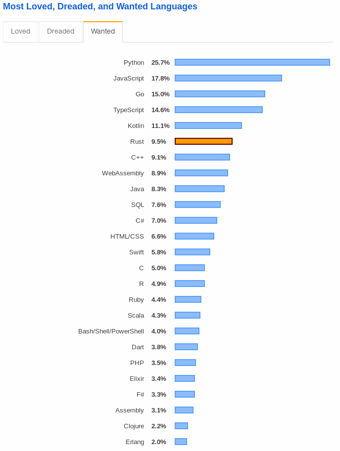

### Rust expansion

* Again, many statistic available
    - should we trust them?

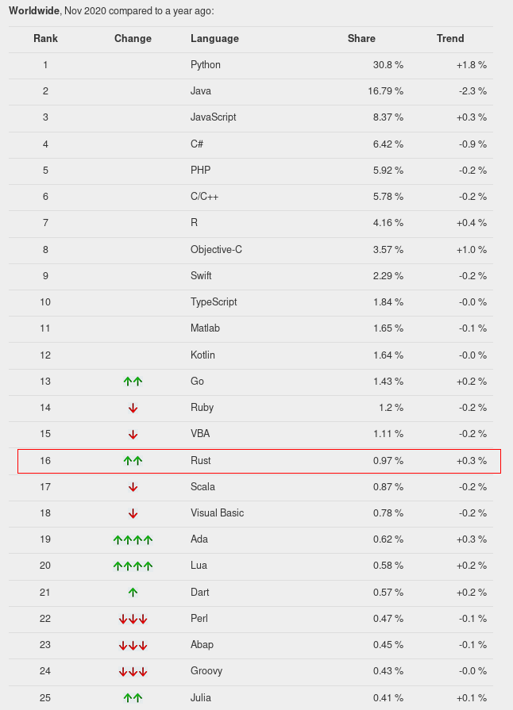

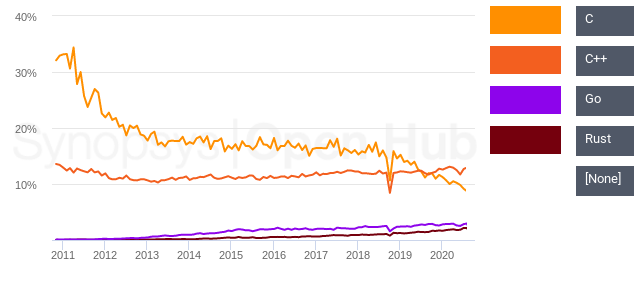

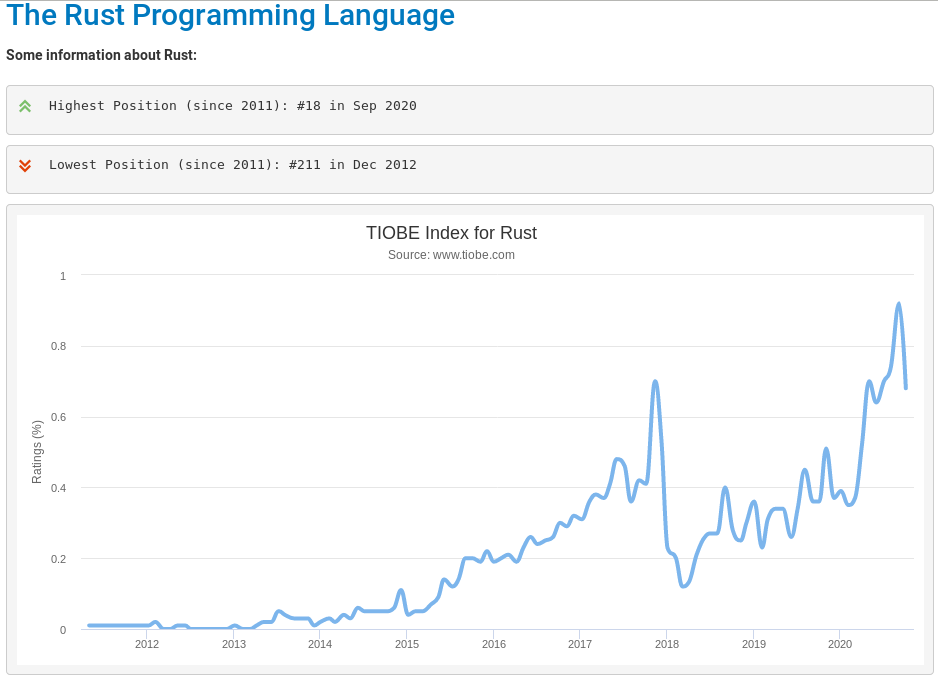

---

## Rust characteristics

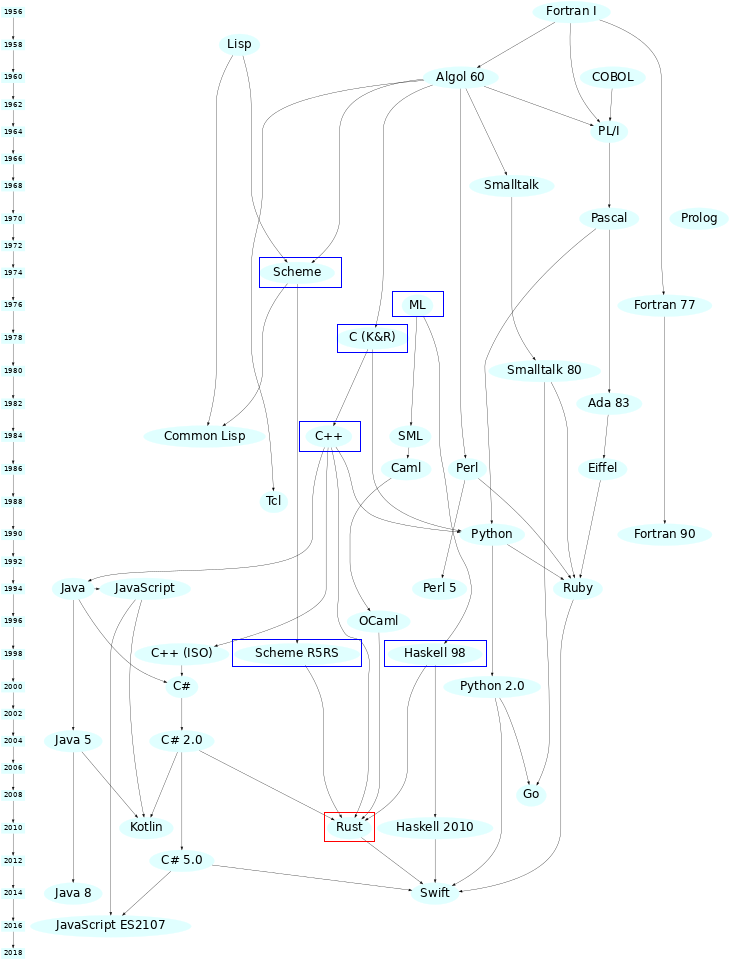

* Goals
    - safe applications
    - parallelization/concurrency
    - performance comparable with C and C++ (even for new features)
    - [https://benchmarksgame-team.pages.debian.net/benchmarksgame/fastest/rust.html](https://benchmarksgame-team.pages.debian.net/benchmarksgame/fastest/rust.html)
    - good compiler messages
    - low level and at the same time high level features
* Don't repeat the same mistakes made in C/C++ and in Java
    - macrosystem
    - pointers
    - NPE
    - strings

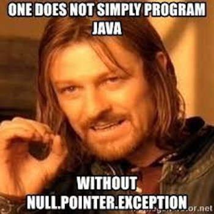

---

## Rust characteristics

* Multiple paradigms supported
    - Imperative
    - Functional
    - some OOP-like properties (but not class-based language)
* Available for all "interesting" platforms
    - Linux
    - (Free)BSD
    - OS X
    - Windows
* Supported by many CPU architectures
    - i686, x86-64, ARMv6/v7 (32), AArch64, MIPS, PowerPC, S390
    - RISC-V
    - Bare Cortex-M0, M0+, M1, M4(F), M7(F) bare = w/o OS, core library only
    - (even for MSP430 - 16bit MCU!)
    - [Platform Support (1)](https://forge.rust-lang.org/platform-support.html)
    - [Platform Support (2)](https://doc.rust-lang.org/nightly/rustc/platform-support.html)
* Now based on LLVM backend
    - Space for more optimizations (WebAssembly via Emscripten or directly)
    - [https://www.rust-lang.org/what/wasm](https://www.rust-lang.org/what/wasm)
* More info
    - [Object-Orientation in Rust](https://stevedonovan.github.io/rust-gentle-intro/object-orientation.html)

---

## Rust characteristics

* Unicode strings (UTF-8)
* Type inference (similar to Go)
* Very strict type checks
* OOP based on structs and traits
    - no classes
    - no objects
    - no interfaces

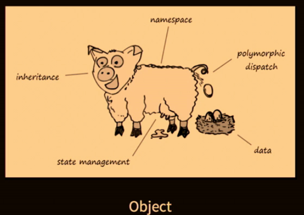

* Values life cycle checked by compiler
    - ownership
    - borrowing
* Safe data handling stored on stack or heap
    - NPE is impossible
* "copy" and "move" semantic
* True generics
* Pattern matching
* Functions are first-class types
    - lambdas etc.

---

## Rust versus C/C++

(D, Nimrod, ...)

* Rust syntax is partially based on C/C++
* Ability to reuse existing ecosystems
    - C functions via Foreign Function Interface (FFI)
    - C++ libraries (some problems remainded)
* C ⇒ Rust
    - [Project Corrode](https://github.com/jameysharp/corrode)

---

## Rust versus Go

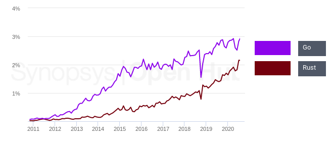

* Probably the are not real competitors
    - OTOH some developers think they are
* Started in approximately the same time
    - Go presented on 2009
    - Rust presented on 2010 (but the theory is a bit olded)
* Both languages focus to solve the (good) old C/C++ problems
    - safety with working with memory
        - now strict REQUIREMENT
        - nobody will be able to develop new language with manual memory management
    - multi-thread applications
    - strings usable in global environments
    - exception states and their detection, control, remediation
    - problems with text macros
* Both compiles to native code
* Both have very rich and standard ecosystem
    - Strict requirement for modern languages
        - pypi
        - Ruby Gems
        - Rust: Cargo
        - Go: started as "one repository, one master"
        - now very quickly switched into Go mod world

### Ok, so are Go and Rust real competitors?

* Rust is more focused to C++ and D developers
    - Very probably will be more used on powerful MCUs
* Go is more oriented to ?aS world
    - Web services
    - Net applications
    - compete with Node.js, Python, Ruby

### And something flame wars related :)

* Source code formatting
    - Go authors
        - we already deciced, go this way
        - better to focus to develop new features
    - Canonical format defined
        - `gofmt`
        - tabs etc.

### Commmon Rust and Go properties

* Both are supported by companies that compete on web browsers area
* Compiles to native code (libraries, executables)
* Good compiler messages
    - non cryptic
    - see one char typo in C++ template
* Syntax is similar to "better" C

### Rust and Go comparisons from developer perspective

```
Language          Rust           Go
Approach          modern         conservative
Syntax            complicated    simple, minimalistic
Learning curve    lower slope    higher slove
Learning curve    higher maximum lower maximum
Compiler speed    slower         faster
Backend           LLVM           custom
```

---

## Communication with compiler

---

## Data types

---

## Other interesting parts of Rust

---

## Object oriented programming in Rust

---

## Memory management

---

## Threads

---

## Testing

---

## Package manager (Cargo)

---

## Selected useful packages

---

## Deployment

---

## Interface to Python

---

## Documentation

* Generated from source codes
* Why?
    - Source is source of truth
* Markdown supported
    - vs Go

---

## Links

* For Complex Applications, Rust is as Productive as Kotlin
  [https://ferrous-systems.com/blog/rust-as-productive-as-kotlin/](https://ferrous-systems.com/blog/rust-as-productive-as-kotlin/)
