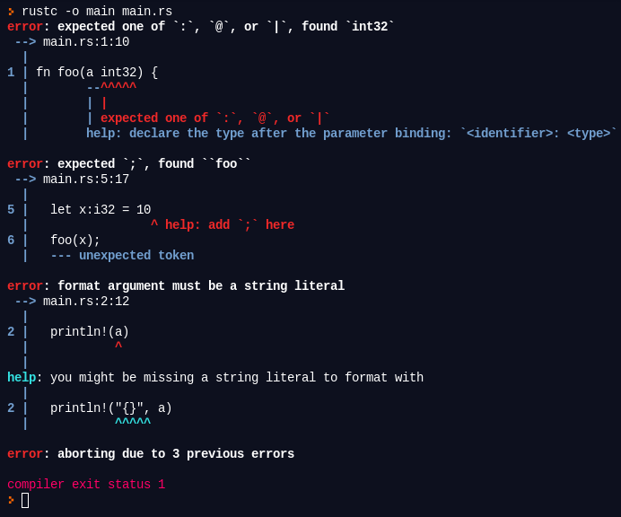
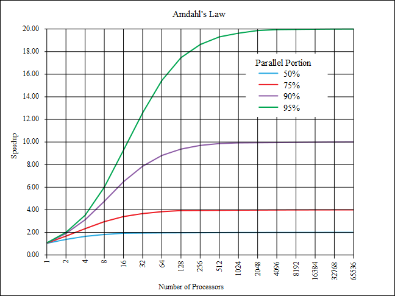

# Rust programming language

* Pavel Tišnovský, Red Hat
    - `ptisnovs@redhat.com`
* Presentation:
    - [https://tisnik.github.io/presentations/coffee-talks/rust.html](https://tisnik.github.io/presentations/coffee-talks/rust.html)
* Presentation source:
    - [https://github.com/tisnik/presentations/blob/master/docs/coffee-talks/rust.md](https://github.com/tisnik/presentations/blob/master/docs-coffee-talks/rust.md)


---

## Table of content

* Requirements to production-ready programming language
* Rust popularity and expansion
* Rust characteristics
* Rust versus C/C++
* Rust versus Go
* Communication with compiler
* Data types
* Other interesting parts of Rust
* Object oriented programming in Rust
* Memory management
* Threads
* Testing
* Package manager (Cargo)
* Selected useful packages
* Deployment
* Interface to Python
* Documentation

---

## Requirements to production-ready programming language

* Program correctness
* Maintainability
* Safety
* Stability of language ecosystem
* Enough developers
* Resource requirements
    - More RAM needed -> more expenses in containerized world
* API and ability to communicate with (micro)services


---

## Rust popularity and expansion

### Popularity of Rust

* More metrics how to measure popularity
    - Tiobe index
    - PYPL (PopularitY of Programming Languages)
    - OpenHub (for registered repositories only)
    - StackOverflow (yearly interrogatory)


### Rust expansion

* Again, many statistic available
    - should we trust them?


---

## Rust characteristics


* Goals
    - safe applications
    - parallelization/concurrency
    - performance comparable with C and C++ (even for new features)
    - [https://benchmarksgame-team.pages.debian.net/benchmarksgame/fastest/rust.html](https://benchmarksgame-team.pages.debian.net/benchmarksgame/fastest/rust.html)
    - good compiler messages
    - low level and at the same time high level features
* Don't repeat the same mistakes made in C/C++ and in Java
    - macrosystem
    - pointers
    - NPE
    - strings


---

## Rust characteristics

* Multiple paradigms supported
    - Imperative
    - Functional
    - some OOP-like properties (but not class-based language)
* Available for all "interesting" platforms
    - Linux
    - (Free)BSD
    - OS X
    - Windows
* Supported by many CPU architectures
    - i686, x86-64, ARMv6/v7 (32), AArch64, MIPS, PowerPC, S390
    - RISC-V
    - Bare Cortex-M0, M0+, M1, M4(F), M7(F) bare = w/o OS, core library only
    - (even for MSP430 - 16bit MCU!)
    - [Platform Support (1)](https://forge.rust-lang.org/platform-support.html)
    - [Platform Support (2)](https://doc.rust-lang.org/nightly/rustc/platform-support.html)
* Now based on LLVM backend
    - Space for more optimizations (WebAssembly via Emscripten or directly)
    - [https://www.rust-lang.org/what/wasm](https://www.rust-lang.org/what/wasm)
* More info
    - [Object-Orientation in Rust](https://stevedonovan.github.io/rust-gentle-intro/object-orientation.html)

---

## Rust characteristics

* Unicode strings (UTF-8)
* Type inference (similar to Go)
* Very strict type checks
* OOP based on structs and traits
    - no classes
    - no objects
    - no interfaces


* Values life cycle checked by compiler
    - ownership
    - borrowing
* Safe data handling stored on stack or heap
    - NPE is impossible
* "copy" and "move" semantic
* True generics
* Pattern matching
* Functions are first-class types
    - lambdas etc.

---

## Rust versus C/C++

(D, Nimrod, ...)

* Rust syntax is partially based on C/C++
* Ability to reuse existing ecosystems
    - C functions via Foreign Function Interface (FFI)
    - C++ libraries (some problems remainded)
* C ⇒ Rust
    - [Project Corrode](https://github.com/jameysharp/corrode)

---

## Rust versus Go


* Probably the are not real competitors
    - OTOH some developers think they are
* Started in approximately the same time
    - Go presented on 2009
    - Rust presented on 2010 (but the theory is a bit olded)
* Both languages focus to solve the (good) old C/C++ problems
    - safety with working with memory
        - now strict REQUIREMENT
        - nobody will be able to develop new language with manual memory management
    - multi-thread applications
    - strings usable in global environments
    - exception states and their detection, control, remediation
    - problems with text macros
* Both compiles to native code
* Both have very rich and standard ecosystem
    - Strict requirement for modern languages
        - pypi
        - Ruby Gems
        - Rust: Cargo
        - Go: started as "one repository, one master"
        - now very quickly switched into Go mod world

### Ok, so are Go and Rust real competitors?

* Rust is more focused to C++ and D developers
    - Very probably will be more used on powerful MCUs
* Go is more oriented to ?aS world
    - Web services
    - Net applications
    - compete with Node.js, Python, Ruby

### And something flame wars related :)

* Source code formatting
    - Go authors
        - we already deciced, go this way
        - better to focus to develop new features
    - Canonical format defined
        - `gofmt`
        - tabs etc.

### Commmon Rust and Go properties

* Both are supported by companies that compete on web browsers area
* Compiles to native code (libraries, executables)
* Good compiler messages
    - non cryptic
    - see one char typo in C++ template
* Syntax is similar to "better" C

### Rust and Go comparisons from developer perspective

```
Language          Rust           Go
Approach          modern         conservative
Syntax            complicated    simple, minimalistic
Learning curve    lower slope    higher slove
Learning curve    higher maximum lower maximum
Compiler speed    slower         faster
Backend           LLVM           custom
Linking           static/dynamic via -buildmode (//export!!!)
Code speed        faster         slower
Type system       huge           without generics (yet)
Immutability      explicit       string, other via interfaces
Memory management ownership      GC
Race condition c. yes            not direcly
Dependency mngm.  cargo          Go modules
```

### Final code speed

* Go
    - custom compiler
    - self hosting
    - (bootstraping problem)
    - faster compilation
    - less optimized machine code
    - (llgo project - Go frontend for LLVM)
* Rust
    - based onLLVM
    - slower compilation
    - optimization at the same level as other LLVM compilers

### More information

* [Rust vs Go in 2020](https://medium.com/@devathon_/rust-vs-go-in-2020-1d472b5ee15)
* [Go vs Rust: Which is Better and Why?](https://appinventiv.com/blog/go-vs-rust/)

---

## Selected Rust properties


---

## Communication with compiler

* Error messages must be precise and should contain help/hint
* Not all programming languages have this philosophy
    - Generate the longest error message in C++
        - [http://tinyurl.com/longest-error-message](http://tinyurl.com/longest-error-message)

### Error messages generated by Rust compiler

```
error[E0382]: use of moved value: `c`
  --> an_example.rs:40:8
   |
39 |     funkce1(c);
   |        - value moved here
40 |     funkce2(c);
   |        ^ value used here after move
   |
   = note: move occurs because `c` has type `std::rc::Rc<Complex>`, which does not implement the `Copy` trait
```

### Second example - many beginners mistakes

```rust
fn foo(a int32) {
  println!(a)
}

fn main() {
  let x:i32 = 10
  foo(x);
}
```



---

## Data types

* Scalars
    - integers `i8`, `u128` etc.
    - floating point
    - Boolean
    - character
* Composited
    - tuples
    - arrays
    - structures
    - enums
* Derived
    - vectors
    - strings
    - ...

### Type inference

```rust
// macro println!
fn main() {
    let x = 6;
    let y = 7;
    let z;
    // now compiler knows types of all variables
    z = x * y;
    println!("{} * {} = {}", x, y, z);
}
```

### Data type `Option`

* Used to replace `null` or `nil` usage
    - Semantically different from `Result` data type
* Two variants:
    - `Some` value
    - `None`
* It is possible to use pattern matching to work with this type
* An example:

```rust
fn div(x: i32, y: i32) -> Option<i32> {
    if y != 0 {
        Some(x / y)
    } else {
        None
    }
}

fn main() {
    let z1 = div(2, 1);
    println!("{:?}", z1);

    let z2 = div(2, 0);
    println!("{:?}", z2);
}
```

### Data type `Result`

* Used to replace `null` or `nil` usage, or special error values
    - Semantically different from `Option` data type
* Two variants:
    - `Ok` value
    - `Err` error value
* It is possible to use pattern matching to work with this type
* An example:

```rust
fn div(x: i32, y: i32) -> Result<i32, &'static str> {
    if y != 0 {
        Ok(x / y)
    } else {
        Err("Divide by zero!")
    }
}

fn main() {
    let z1 = div(2, 1);
    println!("{:?}", z1);

    let z2 = div(2, 0);
    println!("{:?}", z2);
}
```

### Data type `Result` and pattern matching

```rust
fn div(x: i32, y: i32) -> Result<i32, &'static str> {
    if y != 0 {
        Ok(x / y)
    } else {
        Err("Divide by zero!")
    }
}

fn print_div_result(result: Result<i32, &'static str>) {
    match result {
        Ok(value)  => println!("value: {}", value),
        Err(error) => println!("error: {}", error),
    }
}

fn main() {
    let z1 = div(2, 1);
    print_div_result(z1);

    let z2 = div(2, 0);
    print_div_result(z2);
}
```

### Usage of data type `Result` in computation

```rust
fn div(x: i32, y: i32) -> Result<i32, &'static str> {
    if y != 0 {
        Ok(x / y)
    } else {
        Err("Divide by zero!")
    }
}

fn print_div_result(result: Result<i32, &'static str>) {
    match result {
        Ok(value)  => println!("value: {}", value),
        Err(error) => println!("error: {}", error),
    }
}

fn inc(x: i32) -> i32 {
    x + 1
}

fn main() {
    let z0 = div(0, 1);
    print_div_result(z0);
    print_div_result(z0.map(inc));
    let z2 = div(2, 0);
    print_div_result(z2);
    print_div_result(z2.map(inc));
}
```

### Anonymous functions are values

* First-class citizens in the Rust programming language

```rust
fn main() {
    let is_odd = |x: i32| x & 1 == 1;
    //let is_even = |x: i32| !is_odd(x);
    let square = |x: i32| x*x;
    for x in 0..10 {
        println!("{}*{}={}, {} is {} number",
                 x, x, square(x), x, if is_odd(x) {"odd"} else {"even"})
    }
}
```

### Anonymous functions are values (cont.)

```rust
fn main() {
    let is_odd = |x: i32| x & 1 == 1;
    //let is_even = |x: i32| !is_odd(x);
    let square = |x: i32| x*x;
    for x in 0..10 {
        println!("{}*{}={}, {} is {} number",
                 x, x, square(x), x, if is_odd(x) {"odd"} else {"even"})
    }
}
```

---

## Other interesting parts of Rust

* Immutable variables
    - Initial condition for all values
    - Possible to change them via `mut`
* Range (`range`)
* Control structures
    - Return value!
* Anonymous functions
* Higher order functios
    - `map`
    - `filter`
    - `take`
    - `take_while`
    - `fold`
    - Infinite sequences
* Pattern matching
* Macros
* Unsafe blocks

### Factorial table

* Anonymous functions
* Higher order functions

```rust
fn main() {
    for n in 1..10 {
        let fact = (1..n + 1).fold(1, |prod, x| prod * x);
        println!("{}! = {}", n, fact);
    }
}
```

### Infinite sequences

```rust
fn main() {
    let iter1 = 1..;
    let iter2 = iter1.filter(|x| x % 2 == 0);
    let iter3 = iter2.take(10);
    let suma  = iter3.fold(0, |sum, x| sum + x);
    println!("sum = {}", suma);
}
```

### Pattern matching

* All possible paths needs to be covered by code
    - it is checked by compiler, ie in compilation time

```rust
// matching (simplest variant)
fn main() {
    let x: i32 = 1;
    match x {
        0 => println!("zero"),
        1 => println!("one"),
        2 => println!("two"),
        3 => println!("three"),
        _ => println!("something else"),
    }
}
```

### Pattern matching: slightly more complicated construction

```rust
// matching, more complicated
fn classify(x:i32) -> &'static str {
    match x {
        0         => "zero",
        1 | 2     => "one or two",
        3 | 4 | 5 => "from three to five",
        10 ... 20 => "from ten to twenty",
        _         => "something else",
    }
}

fn main() {
    for x in 0..10 {
        println!("{}:{}", x, classify(x))
    }
}
```

---

## Object oriented programming in Rust

* Object ownership
    - Reference
    - „move“ semantic
    - „copy“ semantic
* Traits
    - Combination trait+structure+methods
* Constructors and destructors
    - Trait „Drop“
    - Operator overloading
        - Overloading = trait implementation
* Generic functions
* More info (in Czech)
    - [Programovací jazyk Rust: metody a traity](https://www.root.cz/clanky/programovaci-jazyk-rust-metody-a-traity/)
    - [Generické typy v programovacím jazyku Rust](https://www.root.cz/clanky/genericke-typy-v-programovacim-jazyku-rust/)

---

## Memory management

* Stack versus heap
* Box
* Rc
* Arc
* Arrays and vectors
    - slice

### Box

* Allocated on heap
* „Envelop“ the object or value (number, structure, array, ...)
* Trait Deref - it is possible to access the object/value
* Liveness of objekct and pointer to it
* Can not be `NULL`/`nil`

```rust
fn main() {
    let x = Box::new(42);
    println!("{}", x);
}

let c = Box::new(Complex::new(1.0, 2.0));

// deref
fn print_complex(c: Box<Complex>) {
    println!("Complex number: {:}+{:}i", c.real, c.imag);
}
```

### Rc

* Reference-counted envelope over "real" object/value
* `Rc::clone()`
* If counter==0, object can be deallocated
* Automatic dereference (`Deref` trait)

```rust
fn main() {
    println!("main begin");
    let c = Rc::new(Complex::new(0.0, 0.0));
    c.print();
    {
        println!("inner block begin");
        let c2 = Rc::new(Complex::new(0.0, 0.0));
        c2.print();
        {
            println!("inmost block begin");
            let c3 = Rc::new(Complex::new(0.0, 0.0));
            c3.print();
            println!("inmost block end");
        }
        println!("inner block end");
    }
    println!("main end");
}

// one object that is shared three times
fn main() {
    println!("main begin");
    let c = Rc::new(Complex::new(0.0, 0.0));
    c.print();
    {
        println!("inner block begin");
        let c2 = c.clone();
        c2.print();
        {
            println!("inmost block begin");
            let c3 = c.clone();
            c3.print();
            println!("inmost block end");
        }
        println!("inner block end");
    }
    println!("main end");
}
```

### Arc

* Also based on reference counting, but thread-safe
    - slower than Rc
    - but it is possible to use object from multiple threads
* `Arc::clone()`
* `Deref` trait

```rust
fn start_threads() {
    let c = Arc::new(Complex::new(1.0, 1.0));
    for id in 0..10 {
        let owner = ComplexNumberOwner { id: id, value: c.clone() };
        // move semantic
        // because object can live longer than current thread
        thread::spawn(move || {
                owner.print();
                delay(400);
        });
    }
}
```

### Arrays

* Primitive type in Rust programming language
* Two types of constructors
* It is possible to figure out array length in runtime
* Items are accessed via index/indexes
* Indexing starts from zero
    - like in C, Java, BASIC
    - unlike in Fortran, Lua
* „Array slices“
    - very effective operation

```rust
fn main() {
    // first type of array constructor
    let array = [10, 20, 30, 40];

    // array length in runtime
    println!("array has {} items", array.len());

    // range construct + array length
    for i in 0..array.len() {
        println!("item #{} = {}", i + 1, array[i]);
    }

    // for-each loop over array
    for i in array.iter() {
        println!("{}", i);
    }
}
```

```rust
fn main() {
    // second type of array constructor
    let array = [1; 10];

    // array length in runtime
    println!("array has {} items", array.len());

    // range construct + array length
    for i in 0..array.len() {
        println!("item #{} = {}", i + 1, array[i]);
    }

    // for-each loop over array
    for i in array.iter() {
        println!("{}", i);
    }
}
```

### Vectors

* Usually constructed using `vec!` macro

```rust
fn main() {
    // vector construction using macro
    let vector = vec![1, 2, 3, 4, 5];

    // vector length in runtime
    println!("vector has {} items", vector.len());

    // range construct + vector length
    for i in 0..vector.len() {
        println!("item #{} = {}", i + 1, vector[i]);
    }

    // for-each loop over vector
    for item in vector.iter() {
        println!("{}", item);
    }

    // this is even shorter
    for item in &vector {
        println!("{}", item);
    }
}
```

### „Slice“ from array

```rust
fn main() {
    // array constructor
    let array = [1, 2, 3, 4, 5, 6, 7, 8, 9, 10];

    // slice constructor
    let array2 = &array[2..6];

    // iteration over slice
    for i in array2.iter() {
        println!("{}", i);
    }
}
```

```rust
fn main() {
    // array constructor
    let array = [1, 2, 3, 4, 5, 6, 7, 8, 9, 10];

    // slice constructor
    let array2 = &array[5..];

    // iteration over slice
    for i in array2.iter() {
        println!("{}", i);
    }
}
```

### „Slice“ from vector


```rust
fn main() {
    // vector constructor
    let vector = vec![1, 2, 3, 4, 5, 6, 7, 8, 9, 10];
    println!("vector has {} items", vector.len());

    // slice constructor
    let slice = &vector[3..7];
    println!("slice has {} items", slice.len());
}
```
---

## Threads

* It is required to be able to work with threads
    - especially on current hardware



```rust
use std::thread;

fn main() {
    println!("Starting");
    for i in 1..10 {
        thread::spawn(move || {
            println!("Hello from a thread #{}", i);
        });
    }
    println!("Stopping");
}
```

---

## Testing

---

## Package manager (Cargo)

---

## Selected useful packages

---

## Deployment

---

## Interface to Python

---

## Documentation

* Generated from source codes
* Why?
    - Source is source of truth
* Markdown supported
    - vs Go

---

## Links

* For Complex Applications, Rust is as Productive as Kotlin
  [https://ferrous-systems.com/blog/rust-as-productive-as-kotlin/](https://ferrous-systems.com/blog/rust-as-productive-as-kotlin/)
