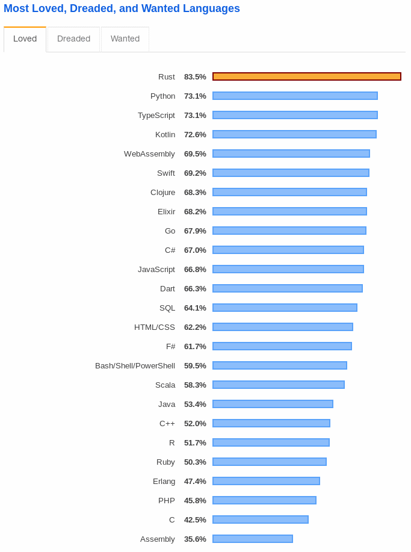
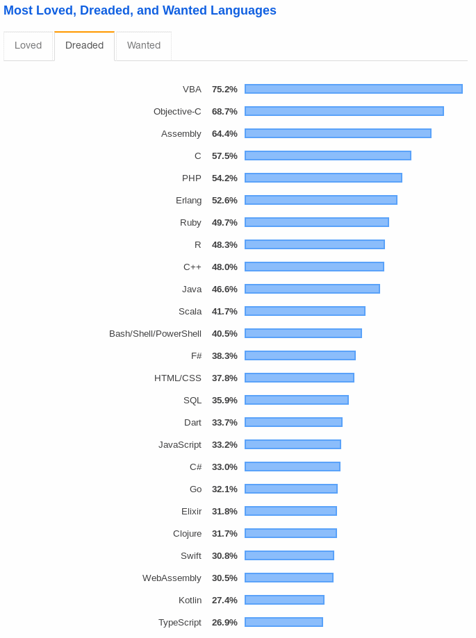
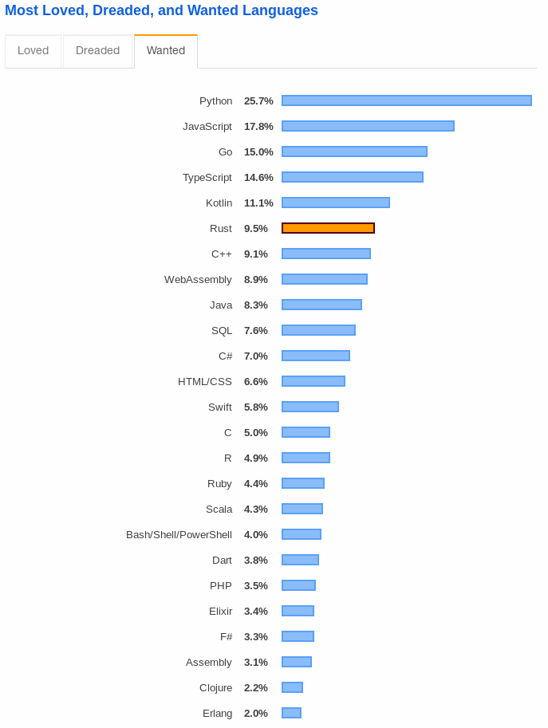
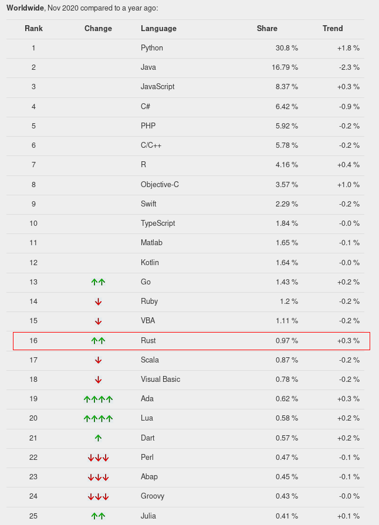
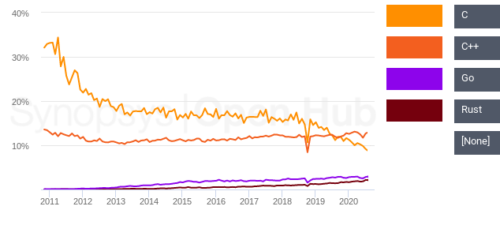

# Použití programovacího jazyka Rust na produkčním systému

* Pavel Tišnovský, Red Hat
    - `ptisnovs@redhat.com`

---

## Anotace

Jazyk Rust se stává mezi programátory stále populárnější alternativou k C++ na
straně jedné a k jazykům vybavených automatickým správcem paměti (GC) na straně
druhé.  Na této přednášce si řekneme, které vlastnosti Rustu zjednodušují jeho
použití v produkčních systémech, které knihovny se nejčastěji používají a jak
se aplikace psané v Rustu zabezpečují.


---

## Obsah přednášky

* Požadavky na produkční jazyk v současnosti
* Popularita a rozšířenost Rustu
* Charakteristické rysy Rustu
* Rust versus C/C++
* Rust versus Go
* Komunikace s překladačem
* Datové typy
* Zajímavé prvky jazyka
* Přístup k OO v Rustu
* Správa paměti
* Vlákna
* Testování
* Správce balíčků (Cargo)
* Vybrané balíčky
* Nasazení aplikací
* Alternativní řešení
* Web Assembly

---

## Požadavky na produkční jazyk v současnosti

* Korektnost programů
* Udržovatelnost
* Bezpečnost
* Stabilita ekosystému
* Dostatek vývojářů
* Nároky na systémové zdroje
    - Více RAM -> větší náklady v kontejnerizovaném světě

---

## Popularita a rozšířenost Rustu

### Popularita Rustu

* Několik různých metodik, jak popularitu měřit
    - Tiobe index
    - PYPL (PopularitY of Programming Languages)
    - OpenHub (pro zaregistrované repositáře)
    - StackOverflow (každoroční dotazníky)







### Rozšířenost Rustu

* Mnoho statistických informací
    - Můžeme jim věřit?






---

## Charakteristické rysy Rustu

* Cíle
    - Bezpečné aplikace
    - Paralelní běh částí aplikace
    - Výkon srovnatelný s C a C++ (i pro nové prvky jazyka)
    - [https://benchmarksgame-team.pages.debian.net/benchmarksgame/fastest/rust.html](https://benchmarksgame-team.pages.debian.net/benchmarksgame/fastest/rust.html)
    - Překladač s rozumným chybovým hlášením
    - Nízkoúrovňový a současně vysokoúrovňový jazyk
* Poučení z chyb, které najdeme například v C/C++ nebo v Javě
    - (=, string, ptr, makrosystém)
    - NPE

---

## Charakteristické rysy Rustu

* Multiparadigmatický jazyk
    - Funcionální rysy
    - Imperativní
    - Má některé OO rysy (ne však systém tříd)
* Dostupný pro všechny „zajímavé“ systémy
    - Linux, (Free)BSD, OS X, Windows
* Používaný na velkém množství architektur procesorů
    - i686, x86-64, ARMv6/v7 (32), AArch64, MIPS, PowerPC, S390
    - RISC-V
    - Bare Cortex-M0, M0+, M1, M4(F), M7(F) bare = bez OS, jen core library
    - (dokonce i pro MSP430 - 16bit MCU!)
    - [https://forge.rust-lang.org/platform-support.html](https://forge.rust-lang.org/platform-support.html)
    - [https://doc.rust-lang.org/nightly/rustc/platform-support.html](https://doc.rust-lang.org/nightly/rustc/platform-support.html)
* Současná verze používá LLVM backend
    - Možnosti pro další vylepšování překladu (dovoluje i WebAssembly přes Emscripten i přímo)
    - [https://www.rust-lang.org/what/wasm](https://www.rust-lang.org/what/wasm)

---

## Charakteristické rysy Rustu

* Unicode řetězce (UTF-8)
* Odvození typů proměnných (type inference)
* Striktní typová kontrola
* OOP založené strukturách (struct) a traitech
    - × třídy, objekty a rozhraní
* Životní cyklus hodnot (zejména referencí)
    - (borrow)
* Bezpečná práce s objekty uloženými na zásobníku i haldě
    - NPE? co to znamená? :-)
* Sémantiky „copy“ a „move“
* Generické parametry funkcí, prvky struktur, ...
* Pattern matching
* Funkce jsou taktéž datovým typem
    - ⇒ lambdy atd.

---

## Rust versus C/C++

(D, Go, Nimrod...)
* Syntaxe Rustu jen částečně odvozena od C/C++
* Využití existujícího „ekosystému“
    - Použití již hotových C knihoven
        - Foreign Function Interface (FFI)
    - C++ knihovny
        - Stále ještě v některých případech problematické
* C ⇒ Rust
    - Project Corrode
    - [https://github.com/jameysharp/corrode](https://github.com/jameysharp/corrode)

---

## Rust versus Go

---

## Komunikace s překladačem

### Chybová hlášení překladače

```
error[E0382]: use of moved value: `c`
  --> an_example.rs:40:8
   |
39 |     funkce1(c);
   |        - value moved here
40 |     funkce2(c);
   |        ^ value used here after move
   |
   = note: move occurs because `c` has type `std::rc::Rc<Complex>`, which does not implement the `Copy` trait
    vs:
    ↓
Generate the longest error message in C++
[http://tinyurl.com/longest-error-message](http://tinyurl.com/longest-error-message)
```

---

## Datové typy

### Odvození typů

```rust
// odvození typu všech proměnných (i z)
// použití makra println!
fn main() {
    let x = 6;
    let y = 7;
    let z;
    // překladač až nyní získá informace o typu
    z = x * y;
    println!("{} * {} = {}", x, y, z);
}
```

### Anonymní funkce jsou hodnotami


```rust
fn main() {
    let is_odd = |x: i32| x & 1 == 1;
    //let is_even = |x: i32| !is_odd(x);
    let square = |x: i32| x*x;
    for x in 0..10 {
        println!("{}*{}={}, {} is {} number",
                 x, x, square(x), x, if is_odd(x) {"odd"} else {"even"})
    }
}
```

### (Anonymní) funkce jsou hodnotami


```rust
fn main() {
    let is_odd = |x: i32| x & 1 == 1;
    //let is_even = |x: i32| !is_odd(x);
    let square = |x: i32| x*x;
    for x in 0..10 {
        println!("{}*{}={}, {} is {} number",
                 x, x, square(x), x, if is_odd(x) {"odd"} else {"even"})
    }
}
```

---

## Zajímavé prvky jazyka

* Neměnitelné hodnoty
    - Výchozí modifikátor
    - Lze změnit pomocí `mut`
* Rozsah (range)
* Řídicí struktury
    - Vrací hodnotu
* Anonymní funkce
* Funkce vyššího řádu
    - `map`
    - `filter`
    - `take`
    - `take_while`
    - `fold`
    - Nekonečné sekvence
* Pattern matching
* Makra
* Unsafe bloky

### Tabulka faktoriálů

```rust
fn main() {
    for n in 1..10 {
        let fact = (1..n + 1).fold(1, |prod, x| prod * x);
        println!("{}! = {}", n, fact);
    }
}
```

### Nekonečné sekvence

```rust
fn main() {
    let iter1 = 1..;
    let iter2 = iter1.filter(|x| x % 2 == 0);
    let iter3 = iter2.take(10);
    let suma  = iter3.fold(0, |sum, x| sum + x);
    println!("sum = {}", suma);
}
```

### Pattern matching


```rust
// matching (nejjednodušší varianta)
fn main() {
    let x: i32 = 1;
    match x {
        0 => println!("zero"),
        1 => println!("one"),
        2 => println!("two"),
        3 => println!("three"),
        _ => println!("something else"),
    }
}
```


```rust
// matching, složitější ukázka
fn classify(x:i32) -> &'static str {
    match x {
        0         => "zero",
        1 | 2     => "one or two",
        3 | 4 | 5 => "from three to five",
        10 ... 20 => "from ten to twenty",
        _         => "something else",
    }
}

fn main() {
    for x in 0..10 {
        println!("{}:{}", x, classify(x))
    }
}
```

---

## Přístup k OO v Rustu

* Vlastnictví objektů
    - Reference
    - Sémantika „move“
    - Sémantika „copy“
* Traity
    - Kombinace trait+struktura+metody
* Konstruktory a destruktory
    - Trait „Drop“
    - Přetěžování operátorů
        - Přetížení = implementace traitu
* Generické funkce

---

## Správa paměti

* Zásobník versus halda
* Box
* Rc
* Arc
* Pole a vektory
    - slice

### Box

* Alokace objektu na haldě
* „Obaluje“ vlastní objekt (číslo, strukturu, pole)
* Trait Deref - snadný přístup k obalenému objektu
* Hlídání životnosti objektu i ukazatele
* Nemůže být NULL/nil

```rust
fn main() {
    let x = Box::new(42);
    println!("{}", x);
}

let c = Box::new(Complex::new(1.0, 2.0));

// deref
fn print_complex(c: Box<Complex>) {
    println!("Complex number: {:}+{:}i", c.real, c.imag);
}
```

### Rc

* Počítání referencí
* Rc::clone()
* Pokud čítač dosáhne nuly, je Rc i objekt jím vlastněný zrušen
* Automatická dereference (Deref trait)

```rust
fn main() {
    println!("main begin");
    let c = Rc::new(Complex::new(0.0, 0.0));
    c.print();
    {
        println!("inner block begin");
        let c2 = Rc::new(Complex::new(0.0, 0.0));
        c2.print();
        {
            println!("inmost block begin");
            let c3 = Rc::new(Complex::new(0.0, 0.0));
            c3.print();
            println!("inmost block end");
        }
        println!("inner block end");
    }
    println!("main end");
}

// jeden sdílený objekt referencovaný třikrát
fn main() {
    println!("main begin");
    let c = Rc::new(Complex::new(0.0, 0.0));
    c.print();
    {
        println!("inner block begin");
        let c2 = c.clone();
        c2.print();
        {
            println!("inmost block begin");
            let c3 = c.clone();
            c3.print();
            println!("inmost block end");
        }
        println!("inner block end");
    }
    println!("main end");
}
```

---

## Vlákna

---

## Testování

* Problematika testování stále složitějších aplikací a systémů
* CI/CD
* Základní problém
    - čím později je chyba odhalena, tím dražší je její oprava
    - z jiného oboru:
        - triviální úprava ventilu při návrhu motoru
        - vs svolávání aut do servisu
        - vs případné žaloby v případě, že chyba způsobí nehody
* Další časté problémy dnešních aplikací
    - velký vývojářský tým
    - používá se větší množství jazyků (jak se domluvit?)
    - zákazník a jeho role při vývoji
    - někdy nejasné role (vývojář či tester?)

### "Pyramida" s různými typy testů

* Business část
    - Beta testy
    - Alfa testy
    - Akceptační testy
* Technologická část
    - UI testy
    - API testy
    - Integrační testy
    - Testy komponent
    - Unit testy
* Další typy testů
    - Benchmarky

---

## Správce balíčků (Cargo)


* [https://crates.io/](https://crates.io/)
* 4,444,104,010 downloads
* 49,047 Crates in stock

---

## Vybrané balíčky

* Jak vybírat?
    - Awesome Rust
    - [https://awesome-rust.com/](https://awesome-rust.com/)

### Databáze

### API

### Logging

### Tracing

### Metriky

### Benchmarks

---

## Nasazení aplikací

---

## Alternativní řešení

---

## Web Assembly

---

## Dokumentace

* Generovaná ze zdrojových kódů
* Proč?
    - Source of truth
* Markdown

---

