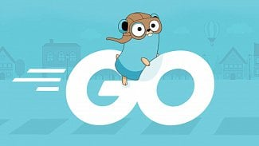

# Go programming language

* Pavel Tišnovský, Red Hat
    - `ptisnovs@redhat.com`
* Presentation:
    - [https://tisnik.github.io/presentations/summer_camp_2021/go.html](https://tisnik.github.io/presentations/summer_camp_2021/go.html)
* Presentation source:
    - [https://github.com/tisnik/presentations/blob/master/docs/summer_camp_2021/go.md](https://github.com/tisnik/presentations/blob/master/summer_camp_2021talks/go.md)

---

## Introduction

- Launched in November 2009 by Google
- Rob Pike, Ken Thompson, Robert Griesemer
- More readable replacement for C/C++/Java/...
- statically typed, compiled, garbage collected
- built-in concurrency
- server-side web (PHP, Node.js, Python)
- cloud technologies (docker, kubernetes)

## Resources
- [Go language course](https://github.com/RedHatOfficial/GoCourse)
- [Tour of Go](https://tour.golang.org/welcome/1)
- [Effective Go](https://golang.org/doc/effective_go.html)
- [Go Doc](https://godoc.org/)

## Development interface
- Vim;-)
- Visual Studio Code + go lang support [[https://code.visualstudio.com/docs/setup/linux]]

