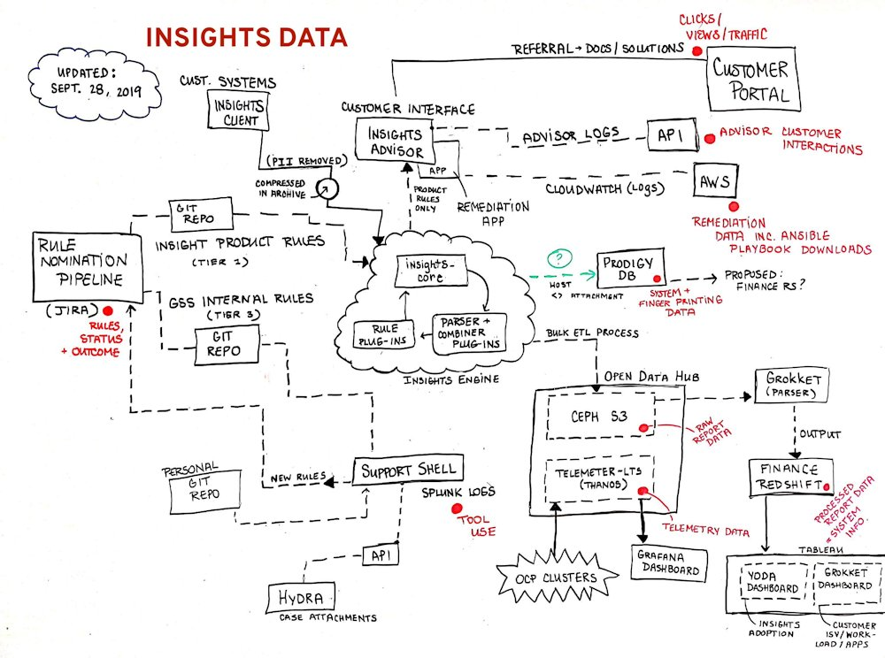

# Top 5 programming languages in Red Hat

## Programming languages popularity in the world

* More different methodologies how to measure popularity
* Tiobe index
* PYPL
    - PopularitY of Programming Languages
* OpenHub
    - for registered developers and projects
* StackOverflow
    - have surveys each year

## Programming languages for learning

* Visual languages
    - Scratch
    - Blockly
* Python
* Java
    - Minecraft
    - Robots
    - ...
* Pascal, Delphi etc.

## Real world

* sometimes just "gluing" components together

## Programming languages in Red Hat
* More different standpoints
    - by product(s)
    - by number of developers
    - we should not forget QA/QE too!
    - by number of lines written
    - by number of lines changed
    - where the statistic was computed

## Red Hat portfolio

* Linux
   - a platform
* Middleware
   - JBoss
   - AMQ
   - 3scale
   - ...
* Virtualisation products
* Containerisation products
* Cloud
* Storage

## Platform

* Kernel + modules and drivers
* Tooling for the platform

## Middleware

* Focus change
    - At the beginning just Java-only world
    - Today it is more diverse
* JBoss EAP
* JBoss Web Server
* Data Grid
* AMQ (Broker)
* Artemis (Broker)
* Application Migration Toolkit
* Process Automation Manager
* Decision Manager
* Runtimes

## Containerisation

* OpenShift Container Platform
* Docker, Podman, Kubernetes

## Storage

* CEPH

## QA/QE

* Very important part of project success
* Automation of QA processes
* Component testing
* Integration testing
* Fuzzy testing
* Chaos testing

## Top 5 languages in Red Hat

* C
* Python
* Java
* Go
* JavaScript

## Other programming languages used in Red Hat

* Ruby
* Groovy
* Rust
* Lua
